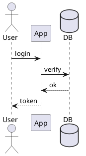

# PlantUML ASCII 图表

## 适用场景

- 需要在终端、邮件、纯文本 README 中展示图表。
- 已经有 PlantUML 源码，想导出 `.atxt` 或 `.utxt`。
- 希望图表可直接进入版本控制，而不是存成图片。
- 如果需要 PNG/SVG 之类图像输出，改用 [concept-to-image](../concept-to-image/SKILL.md)。

## 核心约束

- 依赖 `plantuml`；没有命令时先安装或改走 JAR 方式。
- 复杂图在 ASCII 下可读性会急剧下降，优先保持结构简单。
- `-txt` 是纯 ASCII，`-utxt` 是 Unicode 线框字符；默认优先 `-utxt`。
- 标签要短，长句会直接破坏对齐。

## 代码模式

### 1. 写 `.puml`



### 2. 导出 ASCII

```bash
plantuml -txt login.puml
plantuml -utxt login.puml
```

### 3. JAR 回退

```bash
java -jar plantuml.jar -utxt login.puml
```

## 检查清单

- 已确认要的是文本图，不是图片。
- `.puml` 在图形语义上尽量简化，避免超多节点和长标签。
- 最终输出用等宽字体查看。
- 已确认提交的是 `.puml` 与 `.atxt/.utxt`，而不是只留其中一种。

## 反模式

- 拿一张超复杂部署图硬转 ASCII。
- 在图里塞整句说明文字，导致边框和箭头错位。
- 明明需要图片，还坚持用文本图凑合。
- 只保留导出结果，不保留源 `.puml`。
