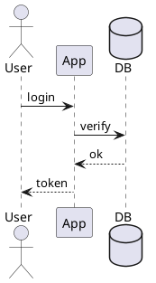

# PlantUML ASCII 图表

## 适用场景

- 需要在终端、邮件、纯文本 README 中展示图表。
- 已经有 PlantUML 源码，想导出 `.atxt` 或 `.utxt`。
- 希望图表可直接进入版本控制，而不是存成图片。
- 如果需要 PNG/SVG 之类图像输出，改用 [concept-to-image](../concept-to-image/SKILL.md)。

## 核心约束

- 依赖 `plantuml`；没有命令时先安装或改走 JAR 方式。
- 复杂图在 ASCII 下可读性会急剧下降，优先保持结构简单。
- `-txt` 是纯 ASCII，`-utxt` 是 Unicode 线框字符；默认优先 `-utxt`。
- 标签要短，长句会直接破坏对齐。

## 代码模式

### 1. 写 `.puml`



### 2. 导出 ASCII

```bash
plantuml -txt login.puml
plantuml -utxt login.puml
```

### 3. JAR 回退

```bash
java -jar plantuml.jar -utxt login.puml
```

## 检查清单

- 已确认要的是文本图，不是图片。
- `.puml` 在图形语义上尽量简化，避免超多节点和长标签。
- 最终输出用等宽字体查看。
- 已确认提交的是 `.puml` 与 `.atxt/.utxt`，而不是只留其中一种。

## 反模式

### FAIL: 复杂部署图硬转

```plantuml
@startuml
node "AWS" {
  cloud "VPC" { ... 50 个节点交叉 }
}
@enduml
```
```bash
plantuml -utxt deploy.puml
# ASCII 输出 200 行 / 箭头错位 / 不可读
```

### PASS: 拆图 / 选图种

```
复杂部署：用 PNG/SVG（concept-to-image）
ASCII 适合：≤ 10 节点的序列图 / 简单流程
```

### FAIL: 长标签破坏对齐

```plantuml
participant "用户登录前先验证邮箱格式和强度" as User
User -> System : 提交注册表单包含完整信息
```

### PASS: 短标签

```plantuml
participant User
participant Auth
User -> Auth : register(email, pwd)
Auth --> User : ok
note right: 详细规则见 doc/auth.md
```