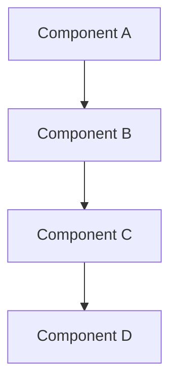

[!NOTE] Generate this report in user's own language.

# {TITLE}

- **研究日期：** {DATE}
- **生成时间：** {TIMESTAMP}
- **置信度：** {CONFIDENCE_LEVEL}
- **研究对象：** {SUBJECT_DESCRIPTION}

---

## 仓库信息

- **名称：** {REPOSITORY_NAME}
- **描述：** {REPOSITORY_DESCRIPTION}
- **URL：** {REPOSITORY_URL}
- **Stars：** {REPOSITORY_STARS}
- **Forks：** {REPOSITORY_FORKS}
- **Open Issues：** {REPOSITORY_OPEN_ISSUES}
- **语言：** {REPOSITORY_LANGUAGES}
- **许可证：** {REPOSITORY_LICENSE}
- **创建时间：** {REPOSITORY_CREATED_AT}
- **最近更新时间：** {REPOSITORY_UPDATED_AT}
- **最近推送时间：** {REPOSITORY_PUSHED_AT}
- **Topics：** {REPOSITORY_TOPICS}

---

## 执行摘要

{EXECUTIVE_SUMMARY}

**重要：** 每条外部结论后都要追加 `[citation:Title](URL)` 形式的内联引用。例如：
"The project gained 10k stars in 3 months [citation:GitHub Stats](https://github.com/owner/repo)."

---

## 完整时间线

### 阶段 1：{PHASE_1_NAME}

#### {PHASE_1_PERIOD}

{PHASE_1_CONTENT}

### 阶段 2：{PHASE_2_NAME}

#### {PHASE_2_PERIOD}

{PHASE_2_CONTENT}

### 阶段 3：{PHASE_3_NAME}

#### {PHASE_3_PERIOD}

{PHASE_3_CONTENT}

---

## 关键分析

**重要：** 每个分析点都要有 `[citation:Title](URL)` 内联引用支撑。

### {ANALYSIS_SECTION_1_TITLE}

{ANALYSIS_SECTION_1_CONTENT}

### {ANALYSIS_SECTION_2_TITLE}

{ANALYSIS_SECTION_2_CONTENT}

---

## 架构 / 系统总览



{ARCHITECTURE_DESCRIPTION}

---

## 指标与影响分析

### 增长轨迹

```
{METRICS_TIMELINE}
```

### 关键指标

| 指标 | 数值 | 评估 |
|------|------|------|
| {METRIC_1} | {VALUE_1} | {ASSESSMENT_1} |
| {METRIC_2} | {VALUE_2} | {ASSESSMENT_2} |
| {METRIC_3} | {VALUE_3} | {ASSESSMENT_3} |

---

## 对比分析

### 功能对比

| 功能 | {SUBJECT} | {COMPETITOR_1} | {COMPETITOR_2} |
|------|-----------|----------------|----------------|
| {FEATURE_1} | {SUBJ_F1} | {COMP1_F1} | {COMP2_F1} |
| {FEATURE_2} | {SUBJ_F2} | {COMP1_F2} | {COMP2_F2} |
| {FEATURE_3} | {SUBJ_F3} | {COMP1_F3} | {COMP2_F3} |

### 市场定位

{MARKET_POSITIONING}

---

## 优势与不足

### 优势

{STRENGTHS}

### 待改进项

{WEAKNESSES}

---

## 关键成功因素

{SUCCESS_FACTORS}

---

## 信息来源

### 一手来源

{PRIMARY_SOURCES}

### 媒体报道

{MEDIA_SOURCES}

### 学术 / 技术资料

{ACADEMIC_SOURCES}

### 社区来源

{COMMUNITY_SOURCES}

---

## 置信度评估

**高置信度（90%+）结论：**
{HIGH_CONFIDENCE_CLAIMS}

**中置信度（70-89%）结论：**
{MEDIUM_CONFIDENCE_CLAIMS}

**较低置信度（50-69%）结论：**
{LOW_CONFIDENCE_CLAIMS}

---

## 研究方法

本报告基于以下过程生成：

1. **多源搜索**：广泛发现与定向检索结合
2. **GitHub 仓库分析**：提交、Issue、PR、活跃度指标
3. **内容提取**：官方文档、技术文章、媒体资料
4. **交叉验证**：跨独立来源核对关键信息
5. **时间线重建**：基于时间戳数据还原演进过程
6. **置信度打分**：按来源可靠性给结论分层

**研究深度：** {RESEARCH_DEPTH}
**时间范围：** {TIME_SCOPE}
**地域范围：** {GEOGRAPHIC_SCOPE}

---

**报告生成方式：** research-expert / repo-analyzer（深度模式）
**报告日期：** {REPORT_DATE}
**报告版本：** 1.0
**状态：** 完成
