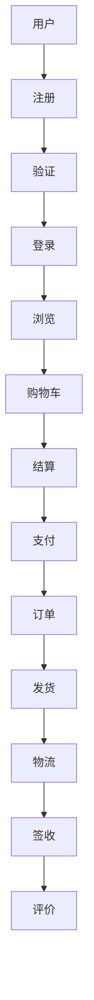

## 代码模式

优先读取这些规范与模板：

- [references/markdown_style_guide.md](references/markdown_style_guide.md)
- [references/mermaid_style_guide.md](references/mermaid_style_guide.md)
- [templates/project_documentation.md](templates/project_documentation.md)
- [templates/pull_request.md](templates/pull_request.md)

```bash
cp templates/project_documentation.md draft.md
sed -n '1,40p' references/markdown_style_guide.md
sed -n '1,40p' references/mermaid_style_guide.md
```

常见图示可以从下面的骨架开始：

```markdown
~~~mermaid
flowchart TD
    A[需求输入] --> B[分析]
    B --> C[文档起草]
    C --> D[评审与修订]
~~~
```

## 检查清单

- 是否先选好了模板，而不是每次从空白页开始。
- 是否读取了对应的样式指南，保证标题、列表、图表命名一致。
- 图表是否真正回答了读者问题，而不是只是把文字搬成方框。
- 是否考虑了后续导出或展示场景，例如给 [md-to-pdf](../md-to-pdf/SKILL.md) 使用时的分页和宽度。
- 交付前是否检查了 Mermaid 代码块的语法与节点命名。

## 反模式

### FAIL: 一张图塞所有逻辑



→ 15+ 节点一张图，读者无法聚焦任何环节。

### PASS: 按主题拆成小图


### FAIL: 用截图代替源码

```markdown
   <!-- 不可 diff、不可在线修改 -->
```

### PASS: 文本化 Mermaid

```markdown
~~~mermaid
flowchart TD
  Client --> Gateway --> Service --> DB
~~~
```
