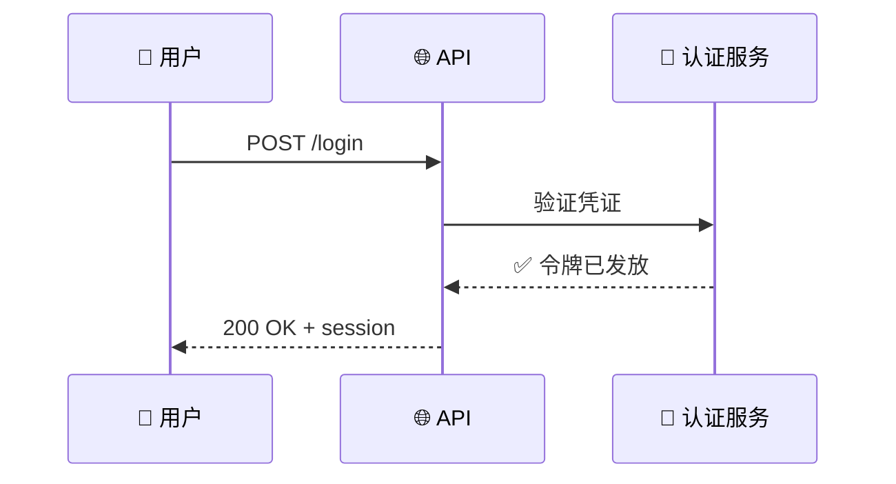

<!-- Source: https://github.com/SuperiorByteWorks-LLC/agent-project | License: Apache-2.0 | Author: Clayton Young / Superior Byte Works, LLC (Boreal Bytes) -->

# Markdown 样式指南

> **对于 AI 代理：** 阅读本文档以了解所有核心格式化规则。在创建任何 markdown 文档时，请遵循这些约定以实现一致、专业的输出。如果您的文档类型存在模板，请从模板开始——参见[模板](#模板)。
>
> **对于人类：** 本指南确保您项目中的每个 markdown 文档都整洁、可扫描、引用规范，并在 GitHub 上呈现良好。从您的记忆文件或贡献指南中引用它。

**目标平台：** GitHub Markdown（Issues、PRs、Discussions、Wikis、`.md` 文件）
**设计目标：** 通过一致的结构、有意义的格式、恰当的引用和策略性地使用图表，创建清晰、专业的文档以有效沟通。

---

## 代理快速入门

1. **识别文档类型** → 检查是否存在[模板](#模板)
2. **先构建结构** → 标题层级，然后是内容
3. **应用本指南中的格式** → 标题、文本、列表、表格、图片、链接
4. **添加引用** → 所有声明和来源使用脚注引用
5. **考虑图表** → [Mermaid 图表](./mermaid_style_guide.md)是否比纯文本更能传达信息？
6. **添加可折叠部分** → 用于补充细节、演讲者备注或较长的上下文
7. **验证** → 运行[质量检查清单](#质量检查清单)

---

## 核心原则

| #   | 原则                         | 规则                                                                                                                                                                                       |
| --- | --------------------------------- | ------------------------------------------------------------------------------------------------------------------------------------------------------------------------------------------ |
| 1   | **在他们提问之前先回答**        | 预测读者的问题并内联解答。优秀的文档在疑问产生时就予以解决——读者读完时不会留下"但是……呢？"的疑问。                            |
| 2   | **首先确保可扫描**               | 读者在阅读之前会先扫读。使用标题、粗体和列表使结构一目了然。                                                                                    |
| 3   | **引用一切**               | 每个声明、统计数字或外部参考都应有带完整 URL 的脚注引用。没有孤立的声明。                                                                                  |
| 4   | **图表优于文字墙**   | 如果概念涉及流程、关系或结构，请在文本旁边使用 [Mermaid 图表](./mermaid_style_guide.md)。                                                               |
| 5   | **慷慨提供信息**     | 不要隐藏细节——把它们展示出来。使用可折叠部分来增加深度而不造成杂乱，但绝不要因为"他们可能不需要"而省略信息。如果相关，就包含它。 |
| 6   | **一致的结构**          | 每个文档使用相同的标题层级、相同的格式模式、相同的 emoji 放置方式。                                                                                              |
| 7   | **每节一个主题**     | 每个标题应涵盖一个主题。如果您在涵盖两个想法，请拆分为两个标题。                                                                                                |
| 8   | **专业但不刻板** | 格式整洁，不杂乱，无装饰性噪音——但不僵硬也不学术。像资深工程师向同事解释那样写作。                                                       |

---

<a id="everything-is-code"></a>

## 🗂️ 一切都是代码

一切都是代码。PR、issue、看板——它们都是您仓库中的 markdown 文件，而不是困在平台数据库中的数据。

### 为什么这很重要

- **可移植** — GitHub → GitLab → Gitea → 任何地方。您的项目管理数据不局限于任何供应商。切换平台时，您的 issue、PR 记录和看板都会随之迁移——它们只是文件。
- **AI 原生** — 代理可以通过本地文件访问读取每个 issue、PR 记录和看板。无需 API 令牌、无速率限制、无平台特定查询。`grep` 每次都胜过 `gh api`。
- **可审计** — 项目管理变更经过与代码变更相同的 PR 审查流程。每次看板更新、每个 issue 状态变更——都在 git 历史中，带有归属和时间戳。

### 工作原理

| 什么                 | 存放位置                                            | GitHub 的作用                                                                                                                                                   |
| -------------------- | --------------------------------------------------------- | ------------------------------------------------------------------------------------------------------------------------------------------------------------------ |
| **Pull request**    | `docs/project/pr/pr-NNNNNNNN-short-description.md`        | GitHub PR 是一个薄引用层——人们在那里评论 diff、批准和观察 CI。变更内容、原因和经验的记录保存在文件中。 |
| **Issue**           | `docs/project/issues/issue-NNNNNNNN-short-description.md` | GitHub Issues 是一个通知和评论层。缺陷报告、功能请求、调查日志和解决方案保存在文件中。                            |
| **看板 (Kanban)**    | `docs/project/kanban/{scope}-{id}-short-description.md`   | 无需外部看板工具。在您的分支中修改看板，通过 PR 合并。看板随代码库一同演进。                                        |
| **决策记录** | `docs/decisions/NNN-{slug}.md`                            | 完全不通过 GitHub 跟踪——纯粹是仓库原生。                                                                                                                 |

### 规则

> 📌 **不要将本应保存在文件中的信息捕获在 GitHub 的 UI 中。** 在 GitHub 中批准 PR。在 GitHub 中观察 CI。在 GitHub 中评论。但实际内容——描述、调查、决策——存放在已提交的文件中。如果值得写下来，就值得提交。

### 跟踪文档的模板

- [Pull request 记录](./templates/pull_request.md) — PR 描述就是这个文件
- [Issue 记录](./templates/issue.md) — 作为仓库文件的缺陷报告和功能请求
- [看板 (Kanban)](templates/kanban.md) — 与代码合并的 Sprint/项目看板

参见[文件约定](#跟踪文档的文件约定)了解目录结构和命名规则。

---

## 文档结构

### 标题和元数据

每个文档以恰好一个 H1 标题开头，后跟一行简短的上下文行和分隔线：

```markdown
# 文档标题

_简要上下文 — 项目名称、日期或用途，一行内_

---
```

- **每个文档一个 H1** — 不要更多
- 上下文行斜体 — 说明这是什么文档、何时以及为谁编写
- 水平线分隔元数据和内容

### 标题层级

| 级别 | 语法          | 用途                     | 每个文档最多    |
| ----- | --------------- | ----------------------- | ------------------- |
| H1    | `# 标题`       | 文档标题          | **1**（恰好一个） |
| H2    | `## 章节`    | 主要章节          | 4–10                |
| H3    | `### 主题`     | 章节内的主题 | 2–5 每个 H2          |
| H4    | `#### 子主题` | 需要时的子主题   | 2–4 每个 H3          |
| H5+   | 切勿使用       | —                       | 0                   |

**规则：**

- **切勿跳过级别** — 不要从 H2 跳到 H4
- **H2 标题中的 emoji** — 每个 H2 一个 emoji，放在开头：`## 📋 项目概览`
- **H3/H4 中无 emoji** — 保持子标题整洁
- **句子大小写** — `## 📋 项目概览` 而不是 `## 📋 项目概览`（专有名词除外）
- **描述性标题** — `### 认证流程` 而不是 `### 详情`

---

## 文本格式

### 粗体、斜体、代码

| 格式     | 语法       | 使用时                                   | 示例                             |
| --------- | ------------ | --------------------------------------------- | ----------------------------------- |
| **粗体**   | `**文本**`   | 关键术语、重要概念、强调       | **主数据库**处理写入 |
| _斜体_   | `*文本*`     | 定义、标题、细微强调          | 此过程称为 _分片_    |
| `代码`     | `` `文本` `` | 技术术语、命令、文件名、值 | 运行 `npm install` 来安装        |
| ~~删除线~~ | `~~文本~~`   | 已弃用的内容、更正               | ~~旧方法~~ 已被 v2 取代     |

**规则：**

- **慎用粗体** — 如果所有内容都是粗体，则没有粗体。每段最多 2-3 个粗体术语。
- **不要组合** 粗体和斜体（`***文本***`）— 选择其一
- **任何技术内容使用代码** — 文件名（`README.md`）、命令（`git push`）、配置值（`true`）、环境变量（`NODE_ENV`）
- **切勿将整个句子加粗** — 对句子中的关键词加粗

### 块引用

对定义、提示和重要说明使用块引用：

```markdown
> **定义：** _负载均衡器_ 将传入的网络流量分布到多个服务器上，以确保没有单个服务器承受过多负载。
```

对于警告和提示：

```markdown
> ⚠️ **警告：** 此操作具有破坏性且不可撤销。

> 💡 **提示：** 使用 `--dry-run` 在应用前预览更改。

> 📌 **注意：** 这需要仓库的管理员权限。
```

- 对于类型化提示，使用 emoji + 粗体标签前缀
- 保持块引用在 1-3 行内
- 不要嵌套块引用（`>>`）

---

## 列表

### 何时使用每种类型

| 列表类型 | 语法       | 使用情况                                  |
| --------- | ------------ | ----------------------------------------- |
| 无序列表    | `- 项目`     | 项目没有固有顺序              |
| 有序列表  | `1. 步骤`    | 步骤必须按顺序执行             |
| 复选框  | `- [ ] 项目` | 跟踪完成状态（议程、检查清单） |

### 格式规则

- **一致缩进** — 子项使用 2 个空格（某些渲染器使用 4 个；选择一种并坚持使用）
- **并行结构** — 列表中的每个项目应具有相同的语法形式
- **末尾不加句号**，除非项目是完整的句子
- **保持简洁** — 如果列表项需要一个段落，则应改为子章节
- **最大嵌套深度：2 层** — 如果需要第三层，请重新组织

```markdown
✅ 好——并行结构，简洁：

- 配置数据库连接
- 运行迁移脚本
- 验证 schema 变更

❌ 坏——混合结构，冗长：

- 你需要配置数据库
- 迁移脚本
- 之后，你应该验证 schema 看起来是否正确
```

---

## 链接和引用

### 内联链接

```markdown
参见 [Mermaid 样式指南](mermaid_style_guide.md) 了解图表约定。
```

- **有意义的链接文本** — `[Mermaid 样式指南]` 而不是 `[点击这里]` 或 `[链接]`
- **内部链接使用相对路径** — `[指南](./README.md)` 而不是绝对 URL
- **外部链接使用完整 URL** — 始终使用 `https://`

### 脚注引用

**每个声明、统计数字或对外部工作的引用都必须有脚注引用。** 这对可信度来说是不可协商的。

```markdown
Markdown 由 John Gruber 在 2004 年创建，是一种轻量级标记语言，
旨在提高可读性[^1]。GitHub 在 2022 年 2 月添加了
Mermaid 图表支持[^2]。

[^1]: Gruber, J. (2004). "Markdown." _Daring Fireball_. https://daringfireball.net/projects/markdown/

[^2]: GitHub Blog. (2022). "Include diagrams in your Markdown files with Mermaid." https://github.blog/2022-02-14-include-diagrams-markdown-files-mermaid/
```

**引用格式：**

```
[^N]: 作者/组织. (年份). "标题." *出版物*. https://完整-url
```

**规则：**

- **按顺序编号** — `[^1]`, `[^2]`, `[^3]` 按出现顺序
- **始终包含完整 URL** — 读者必须能够访问来源
- **将所有脚注放在文档底部** — 在 `## 参考文献` 部分或最末尾
- **每个外部声明都需要一个** — 统计数字、引用、方法论、提到的工具
- **内部项目链接不需要脚注** — 改用内联链接

### 引用样式链接（用于重复的 URL）

当同一 URL 出现多次时，使用引用样式链接以保持文本整洁：

```markdown
[官方文档][mermaid-docs] 涵盖了所有图表类型。
参见 [Mermaid 文档][mermaid-docs] 了解完整语法。

[mermaid-docs]: https://mermaid.js.org/ 'Mermaid Documentation'
```

---

## 图片和图表

### 放置和语法

```markdown

_图 1：显示三层部署模型的系统架构_
```

**规则：**

- **与内容内联** — 将图片放在相关内容旁边，而不是单独的"图片"部分
- **描述性替代文本** — `![三层架构图]` 而不是 `![图片]` 或 `![截图]`
- **下方斜体说明** — `*图 N：此图片展示的内容*`
- **按顺序编号图片** — 如有多个图片，使用图 1、图 2 等
- **相对路径** — `images/file.png` 而不是绝对路径
- **合理的文件大小** — 压缩 PNG，尽可能使用 SVG

### 图片命名约定

```
{文档-别名}_{描述}.{后缀}

示例：
  auth_flow_overview.png
  deployment_architecture.svg
  api_response_example.png
```

### 何时不使用图片

如果内容可以表示为 **Mermaid 图表**，则优先于静态图片：

| 场景                   | 使用                                        |
| -------------------------- | ------------------------------------------ |
| 架构图       | Mermaid `flowchart` 或 `architecture-beta` |
| 序列/交互       | Mermaid `sequenceDiagram`                  |
| 数据模型                 | Mermaid `erDiagram`                        |
| 时间线                   | Mermaid `timeline` 或 `gantt`              |
| UI 截图           | 图片（Mermaid 无法做到）              |
| 照片/真实世界图片   | 图片                                      |
| 复杂数据可视化 | 图片或 Mermaid `xychart-beta`            |

参见 [Mermaid 样式指南](./mermaid_style_guide.md) 了解图表类型选择与样式。

---

## 表格

### 何时使用表格

- **结构化比较** — 功能、选项、权衡
- **参考数据** — 配置值、API 参数、状态码
- **日程表和矩阵** — 时间线、职责分配

### 何时不使用表格

- **叙述性内容** — 改用段落
- **简单列表** — 改用项目符号
- **超过 5 列** — 在移动设备上变得不可读；重新组织

### 格式化

```markdown
| 功能 | 免费版 | 专业版 | 企业版 |
| ------- | --------- | -------- | ---------- |
| 用户数   | 5         | 50       | 无限  |
| 存储空间 | 1 GB      | 100 GB   | 自定义     |
| 支持 | 社区    | 邮件    | 专用  |
```

**规则：**

- **始终有标题行** — 没有无标题的表格
- **文本列左对齐** — `|---|`（默认）
- **数字列右对齐** — 适当时使用 `|---:|`
- **简洁的单元格内容** — 每个单元格 1-5 个词。如果需要更多，就不是表格的问题
- **关键列加粗** — 第一列或读者最先扫描的列
- **列内格式一致** — 不要混合使用句子和片段

---

## 代码块

### 内联代码

在正文中使用反引号表示技术术语：

```markdown
运行 `git status` 检查未提交的更改。
`NODE_ENV` 变量控制运行时环境。
```

### 围栏代码块

始终指定语言以实现语法高亮：

````markdown
```python
def calculate_average(values: list[float]) -> float:
    """返回数值列表的算术平均值。"""
    return sum(values) / len(values)
```
````

**规则：**

- **始终包含语言标识符** — ` ```python `、` ```bash `、` ```json ` 等。
- **纯输出使用 ` ```text `** — 而不是无语言的 ` ``` `
- **保持块聚焦** — 显示相关片段，而不是整个文件
- **如需上下文，添加注释** — 块顶部添加 `# 配置数据库连接`

---

## 可折叠部分

使用 HTML `<details>` 放置不应干扰主流程的补充内容——演讲者备注、实现细节、冗长日志或可选的深入内容。

```markdown
<details>
<summary><strong>💬 演讲者备注</strong></summary>

- 关键谈话要点一
- 过渡到下一个主题
- **粗体**强调在 details 内部有效
- [链接](https://example.com)也有效

</details>

---
```

**规则：**

- **默认折叠** — `<details>` 标签自动折叠
- **描述性摘要** — `<strong>💬 演讲者备注</strong>` 或 `<strong>📋 实现细节</strong>`
- **`<summary>` 标签后空一行** — 对于块内 markdown 渲染是必需的
- **始终后跟 `---`** — 每个 `</details>` 后使用水平线作为视觉分隔
- **内部支持任何 markdown** — 项目符号、粗体、链接、代码块、表格

### 常见的可折叠模式

| 摘要标签         | 用途                                          |
| --------------------- | ------------------------------------------------ |
| 💬 **演讲者备注**  | 演示文稿的谈话要点、时间安排、过渡 |
| 📋 **详情**        | 扩展说明、详细上下文            |
| 🔧 **实现** | 技术细节、代码示例、配置          |
| 📊 **原始数据**       | 完整输出、日志、数据表格                   |
| 💡 **背景**     | 有助益但不必要的上下文           |

---

## 水平线

使用 `---`（三个连字符）进行视觉分隔：

```markdown
---
```

**使用场景：**

- **每个 `</details>` 块之后** — 强制性的，创建清晰的分隔
- **标题/元数据之后** — 分隔文档头部和内容
- **主要章节之间** — 当 H2 标题本身不足以创建视觉分隔时
- **脚注/参考文献之前** — 分隔内容和引用列表

**不使用场景：**

- 每个段落之间（过于拥挤）
- 同一 H2 内的 H3 子章节之间（使用空白代替）

---

## 认可的 Emoji 集

每个 H2 标题一个 emoji，放在开头。在正文中谨慎使用，仅用于提示和强调。

### 章节标题

| Emoji | 用途                                |
| ----- | -------------------------------------- |
| 📋    | 概览、摘要、议程、检查清单   |
| 🎯    | 目标、目的、成果、指标   |
| 📚    | 内容、文档、主体      |
| 🔗    | 资源、参考文献、链接           |
| 📍    | 议程、导航、当前位置   |
| 🏠    | 内务、后勤、公告 |
| ✍️    | 任务、作业、行动项       |

### 状态和结果

| Emoji | 含义                              |
| ----- | ------------------------------------ |
| ✅    | 成功、完成、正确、已批准 |
| ❌    | 失败、错误、避免、已拒绝  |
| ⚠️    | 警告、注意、重要提示   |
| 💡    | 提示、洞察、想法、最佳实践    |
| 📌    | 重要、关键点、请记住       |
| 🚫    | 禁止、不要做、已阻止          |

### 技术和流程

| Emoji | 含义                           |
| ----- | --------------------------------- |
| ⚙️    | 配置、设置、流程  |
| 🔧    | 工具、实用程序、设置           |
| 🔍    | 分析、调查、审查   |
| 📊    | 数据、指标、分析          |
| 📈    | 增长、趋势、改进       |
| 🔄    | 循环、刷新、迭代         |
| ⚡    | 性能、速度、快速操作  |
| 🔐    | 安全、认证、隐私 |
| 🌐    | Web、API、网络、全局         |
| 💾    | 存储、数据库、持久化    |
| 📦    | 包、制品、部署     |

### 人员和协作

| Emoji | 含义                             |
| ----- | ----------------------------------- |
| 👤    | 用户、个人、个体            |
| 👥    | 团队、小组、协作          |
| 💬    | 讨论、评论、演讲者备注 |
| 🎓    | 学习、教育、知识      |
| 🤔    | 问题、思考、反思 |

### Emoji 规则

1. **每个 H2 标题开头一个** — `## 📋 概览`
2. **H3/H4 中无 emoji** — 保持子标题整洁
3. **正文中谨慎使用** — 仅用于提示（`> ⚠️ **警告：**`）和关键标记
4. **切勿在**：标题（H1）、代码块、链接文本、表格数据单元格中使用
5. **无装饰性 emoji** — 🎉 💯 🔥 🎊 💥 ✨ 增加噪音，而非意义
6. **一致性** — 项目内所有文档中相同的 emoji = 相同的含义

---

## Mermaid 图表集成

**每当内容描述流程、结构、关系或过程时，考虑 Mermaid 图表是否比纯文本更有效。** 图表和文本结合比单独使用任何一种都更有效。

### 何时添加图表

**每当您的文本描述流程、结构、关系、时间或比较时，都有一种 Mermaid 图表能更好地传达信息。** 扫描下表以确定正确的类型，然后按照此工作流操作：

1. **先阅读 [Mermaid 样式指南](./mermaid_style_guide.md)** — emoji、调色板、可访问性、复杂度管理
2. **然后打开特定类型文件** — 范例、技巧、模板、复杂示例

| 您的内容描述...                            | 添加...                 | 类型文件                                           |
| ---------------------------------------------------- | ------------------------ | --------------------------------------------------- |
| 流程步骤、工作流、决策逻辑         | **流程图**            | [flowchart.md](./diagrams/flowchart.md)       |
| 谁与谁在何时通信（API 调用、消息）     | **序列图**     | [sequence.md](./diagrams/sequence.md)         |
| 类层次结构、类型关系、接口      | **类图**        | [class.md](./diagrams/class.md)               |
| 状态转换、实体生命周期、状态机  | **状态图**        | [state.md](./diagrams/state.md)               |
| 数据库 schema、数据模型、实体关系    | **ER 图**           | [er.md](./diagrams/er.md)                     |
| 项目时间线、路线图、任务依赖关系         | **甘特图**          | [gantt.md](./diagrams/gantt.md)               |
| 整体的部分、比例、分布          | **饼图**            | [pie.md](./diagrams/pie.md)                   |
| Git 分支策略、合并/发布流程           | **Git 图**    | [git_graph.md](./diagrams/git_graph.md)       |
| 概念层次、头脑风暴、主题图             | **思维导图**              | [mindmap.md](./diagrams/mindmap.md)           |
| 按时间顺序的事件、里程碑、历史            | **时间线**             | [timeline.md](./diagrams/timeline.md)         |
| 用户体验、满意度评分、旅程        | **用户旅程图**         | [user_journey.md](./diagrams/user_journey.md) |
| 双轴比较、优先级排序矩阵           | **象限图**       | [quadrant.md](./diagrams/quadrant.md)         |
| 需求追溯、合规映射        | **需求图**  | [requirement.md](./diagrams/requirement.md)   |
| 不同缩放级别的系统架构           | **C4 图**           | [c4.md](./diagrams/c4.md)                     |
| 流量大小、资源分布、预算       | **桑基图**       | [sankey.md](./diagrams/sankey.md)             |
| 数值趋势、柱状图、折线图              | **XY 图**             | [xy_chart.md](./diagrams/xy_chart.md)         |
| 组件布局、空间排列、图层        | **框图**        | [block.md](./diagrams/block.md)               |
| 工作项跟踪、状态面板、任务列       | **看板图**         | [kanban.md](./diagrams/kanban.md)             |
| 二进制协议布局、数据包格式           | **数据包图**       | [packet.md](./diagrams/packet.md)             |
| 云基础设施、服务拓扑、网络   | **架构图** | [architecture.md](./diagrams/architecture.md) |
| 多维比较、技能、雷达分析 | **雷达图**          | [radar.md](./diagrams/radar.md)               |
| 层级比例、预算分解           | **矩形树图**              | [treemap.md](./diagrams/treemap.md)           |

> 💡 **选择正确的类型，而不是简单的类型。** 不要对所有内容都默认使用流程图——时间线对于按时间顺序的事件更好，序列图对于服务交互更好，ER 图对于数据模型更好。扫描上表并将您的内容与最具体的类型匹配。**如果您发现自己正在写一段描述视觉概念的段落，停下来，用图表表示它。**

### 如何集成

将图表**内联放置在相关文本旁边**，而不是单独的章节中：

~~~markdown
### 认证流程

登录过程验证凭证、检查 MFA 状态，
并发放会话令牌。失败的尝试会被记录用于
安全监控。



令牌在 24 小时后过期。参见[认证流程](#认证流程)
了解刷新令牌的详细信息。
~~~

**始终遵循 [Mermaid 样式指南](./mermaid_style_guide.md)** 进行图表样式设置——emoji、颜色类、可访问性（`accTitle`/`accDescr`）和特定类型约定。

---

## 空白和间距

- **段落之间空一行** — 始终
- **标题前后空一行** — 始终
- **代码块前后空一行** — 始终
- **块引用前后空一行** — 始终
- **列表项之间无空行** — 保持列表紧凑
- **无尾随空格** — 干净的行尾
- **文件末尾一个空行** — 标准约定
- **连续空行不超过一个** — 两个空行 = 间距过大

---

## 质量检查清单

### 结构

- [ ] 恰好一个 H1 标题
- [ ] 标题层级正确（H1 → H2 → H3 → H4，无跳跃）
- [ ] 每个 H2 开头恰好有一个 emoji
- [ ] H3 和 H4 无 emoji
- [ ] 标题元数据后和每个 `</details>` 块后有水平线

### 内容

- [ ] 每个外部声明有脚注引用
- [ ] 所有脚注有完整 URL
- [ ] 所有链接已测试且有效
- [ ] 有意义的链接文本（无"点击这里"）
- [ ] 关键术语使用粗体，而非整个句子
- [ ] 所有技术术语使用代码格式

### 视觉元素

- [ ] 图片有描述性替代文本
- [ ] 图片有斜体图标题
- [ ] 图片与相关内容内联放置（不在单独章节中）
- [ ] 表格有标题行和一致格式
- [ ] 已考虑使用 Mermaid 图表（带 `accTitle`/`accDescr`）

### 可折叠部分

- [ ] `<details>` 块有描述性 `<summary>` 标签
- [ ] `<summary>` 标签后有空行（用于 markdown 渲染）
- [ ] 每个 `</details>` 块后有水平线 `---`
- [ ] 内部内容折叠后正确渲染

### 完善

- [ ] 无拼写或语法错误
- [ ] 一致的空白（无尾随空格，无双空行）
- [ ] 列表中平行的语法结构
- [ ] 在 GitHub 亮色和暗色模式下正确渲染

---

## 模板

模板为常见文档类型提供预构建的结构。复制模板，填写您的内容，并按照本样式指南进行格式化。每个模板强制执行上述原则——引用、图表、可折叠深度和自回答结构。

| 文档类型                   | 模板                                                                | 最适合                                                                                              |
| ------------------------------- | ----------------------------------------------------------------------- | ----------------------------------------------------------------------------------------------------- |
| 演示文稿/简报         | [presentation.md](./templates/presentation.md)                   | 幻灯片风格文档，带演讲者备注、结构化章节和视觉流程                   |
| 研究论文/分析       | [research_paper.md](./templates/research_paper.md)               | 数据驱动分析、文献综述、方法论 + 发现，带大量引用                 |
| 项目文档           | [project_documentation.md](./templates/project_documentation.md) | 软件/产品文档——架构、快速入门、API 参考、贡献指南              |
| 决策记录 (ADR/RFC)       | [decision_record.md](./templates/decision_record.md)             | 记录决策原因——上下文、评估选项、结果、后果                 |
| 操作指南/教程         | [how_to_guide.md](./templates/how_to_guide.md)                   | 分步说明，带先决条件、验证步骤和故障排除                 |
| 状态报告/高管简报 | [status_report.md](./templates/status_report.md)                 | 进度更新、风险摘要、需要做出的决策——供领导层和利益相关者使用                  |
| Pull request 记录             | [pull_request.md](./templates/pull_request.md)                   | PR 文档，带变更清单、测试证据、回滚计划和审查备注             |
| Issue 记录                    | [issue.md](./templates/issue.md)                                 | 缺陷报告（复现步骤、根因）和功能请求（验收标准、用户故事） |
| 看板                    | [kanban.md](templates/kanban.md)                               | Sprint/发布/项目工作跟踪，带可视化看板、WIP 限制、指标和阻塞项        |

### 跟踪文档的文件约定

某些模板生成的文档会随时间积累。使用以下目录约定：

| 文档类型    | 目录              | 命名模式                              | 示例                                                                 |
| ---------------- | ---------------------- | ------------------------------------------- | ----------------------------------------------------------------------- |
| Pull request    | `docs/project/pr/`     | `pr-NNNNNNNN-short-description.md`          | `docs/project/pr/pr-00000123-fix-auth-timeout.md`                       |
| Issue           | `docs/project/issues/` | `issue-NNNNNNNN-short-description.md`       | `docs/project/issues/issue-00000456-add-export-filter.md`               |
| 看板    | `docs/project/kanban/` | `{scope}-{identifier}-short-description.md` | `docs/project/kanban/sprint-2026-w07-agentic-template-modernization.md` |
| 决策记录 | `docs/decisions/`      | `NNN-{slug}.md`                             | `docs/decisions/001-use-postgresql.md`                                  |
| 状态报告   | `docs/status/`         | `status-{date}.md`                          | `docs/status/status-2026-02-14.md`                                      |

### 选择模板

- **需要向人演示？** → 演示文稿
- **发布分析或研究？** → 研究论文
- **记录代码库或产品？** → 项目文档
- **记录为什么选择 X 而非 Y？** → 决策记录
- **教人做某事？** → 操作指南
- **向领导层更新进度？** → 状态报告
- **记录 PR 供日后参考？** → Pull request 记录
- **跟踪缺陷或请求功能？** → Issue 记录
- **管理 Sprint 或项目的工作项？** → 看板
- **以上都不适合？** → 直接使用本样式指南的规则——无需模板

---

## 常见错误

### ❌ 每个标题多个 emoji

```markdown
## 📚📊📈 内容主题 ← 太多
```

✅ 修复：每个 H2 一个 emoji

```markdown
## 📚 内容主题
```

### ❌ 缺少引用

```markdown
研究表明 73% 的开发者更喜欢 Markdown。← 来源在哪？
```

✅ 修复：添加脚注

```markdown
研究表明 73% 的开发者更喜欢 Markdown[^1]。

[^1]: Stack Overflow. (2024). "Developer Survey Results." https://survey.stackoverflow.co/2024
```

### ❌ 无结构的文字堆砌

```markdown
系统通过首先检查 JWT 令牌有效性来处理认证，
然后验证用户是否存在于数据库中，接着
检查他们对请求资源的权限...
```

✅ 修复：使用列表、标题或图表

```markdown
### 认证流程

1. 验证 JWT 令牌签名和过期时间
2. 验证用户是否存在于数据库中
3. 检查用户对请求资源的权限
```

### ❌ 图片放在单独的章节中

```markdown
## 内容

[段落文本]

## 截图

[所有图片集中放在这里] ← 与上下文脱节
```

✅ 修复：将图片内联放置在相关位置

### ❌ 可折叠部分后无水平线

```markdown
</details>
### 下一个主题  ← 视觉上连在一起
```

✅ 修复：始终在 `</details>` 后添加 `---`

```markdown
</details>

---
### 下一个主题 ← 清晰分隔
```

---

## 资源

- [GitHub Flavored Markdown Spec](https://github.github.com/gfm/) · [Mermaid 样式指南](./mermaid_style_guide.md) · [GitHub 基本格式化](https://docs.github.com/en/get-started/writing-on-github/getting-started-with-writing-and-formatting-on-github/basic-writing-and-formatting-syntax)
