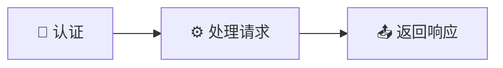
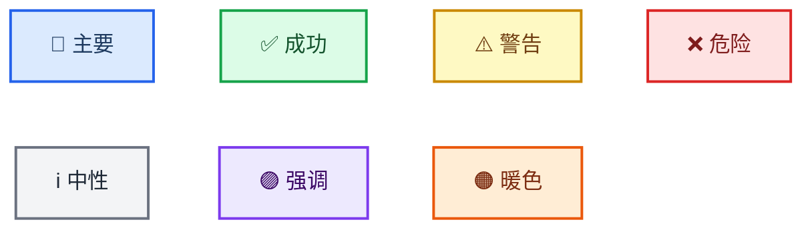

<!-- Source: https://github.com/SuperiorByteWorks-LLC/agent-project | License: Apache-2.0 | Author: Clayton Young / Superior Byte Works, LLC (Boreal Bytes) -->

# Mermaid 图表样式指南

> **对于 AI 代理：** 阅读本文档以了解所有核心样式规则。然后使用[图表选择表](#选择合适的图表)选择正确的类型并跟随其链接——每种类型都有自己的文件，包含生产质量的范例、技巧和可复制粘贴的模板。
>
> **对于人类：** 本指南 + 链接的图表文件确保您仓库中的每个 Mermaid 图表都是可访问的、专业的，并在 GitHub 亮色和暗色模式下干净呈现。从您的记忆文件或贡献指南中引用它。

**目标平台：** GitHub Markdown（Issues、PRs、Discussions、Wikis、`.md` 文件）
**设计目标：** 极简的专业样式，在 GitHub 亮色和暗色模式下均美观呈现，对屏幕阅读器可访问，并以零视觉噪音清晰传达信息。

---

## 代理快速入门

1. **选择图表类型** → [选择表](#选择合适的图表)
2. **打开该类型的文件** → 复制模板，填写内容
3. **应用本文档的样式** → 从[认可的 Emoji 集](#认可的-emoji-集)使用 emoji，从[认可的调色板](#github-兼容的颜色类)使用颜色
4. **添加可访问性** → `accTitle` + `accDescr`（对于不支持的类型，用斜体 Markdown 段落）
5. **验证** → 在亮色模式、暗色模式和屏幕阅读器下渲染

---

## 核心原则

| #   | 原则                      | 规则                                                                                                   |
| --- | ------------------------------ | ------------------------------------------------------------------------------------------------------ |
| 1   | **每个规模都清晰**     | 简单图表保持平坦。复杂图表使用子图。非常复杂的图表拆分为概览 + 详图。 |
| 2   | **始终可访问**              | 每个图表都有 `accTitle` + `accDescr`。无例外。                                             |
| 3   | **主题中立**              | 没有 `%%{init}` 主题指令。没有内联 `style`。让 GitHub 自动主题化。                              |
| 4   | **语义清晰**           | `snake_case` 节点 ID 与标签匹配。主动语态。句子大小写。                                  |
| 5   | **一致样式**         | 相同的 emoji = 所有地方相同的含义。相同的形状 = 相同的语义。                                    |
| 6   | **极简专业风格** | 一点 emoji + 策略性粗体 + 可选的 `classDef`——绝不多加。                                  |

---

## 可访问性要求

**每个图表必须包含 `accTitle` 和 `accDescr`：**

```
accTitle: 简短名称 3-8 个词
accDescr: 一两个句子解释此图表显示的内容以及读者可以从中获得的洞察
```

- `accTitle` — 3-8 个词，纯文本，命名图表
- `accDescr` — 1-2 句话，在**一行内**（GitHub 限制），解释用途和关键结构

**不支持 `accTitle`/`accDescr` 的图表类型：** Mindmap、Timeline、Quadrant、Sankey、XY Chart、Block、Kanban、Packet、Architecture、Radar、Treemap。对于这些类型，在代码块上方放置一个斜体描述性 Markdown 段落作为可访问描述。

> **ZenUML 注意：** ZenUML 需要外部插件，可能在 GitHub 上无法渲染。推荐使用标准的 `sequenceDiagram` 语法。

---

## 主题配置

### ✅ 做：无主题指令（GitHub 自动检测）



### ❌ 不要：内联样式或自定义主题

```
%% 坏——会破坏暗色模式
style A fill:#e8f5e9
%%{init: {'theme':'base'}}%%
```

---

## 认可的 Emoji 集

每个节点一个 emoji，放在标签开头。相同的 emoji = 项目中所有图表中相同的含义。

### 系统与基础设施

| Emoji | 含义                           | 示例                   |
| ----- | --------------------------------- | ------------------------- |
| ☁️    | 云 / 平台 / 托管服务      | `[☁️ AWS Lambda]`         |
| 🌐    | 网络 / Web / 连接      | `[🌐 API 网关]`        |
| 🖥️    | 服务器 / 计算 / 机器        | `[🖥️ 应用服务器]` |
| 💾    | 存储 / 数据库 / 持久化  | `[💾 PostgreSQL]`         |
| 🔌    | 集成 / 插件 / 连接器  | `[🔌 Webhook 处理器]`    |

### 流程与操作

| Emoji | 含义                          | 示例                   |
| ----- | -------------------------------- | ------------------------- |
| ⚙️    | 流程 / 配置 / 引擎 | `[⚙️ 构建流水线]`     |
| 🔄    | 循环 / 同步 / 重复流程 | `[🔄 重试循环]`         |
| 🚀    | 部署 / 启动 / 发布        | `[🚀 发布到生产环境]` |
| ⚡    | 快速操作 / 触发 / 事件    | `[⚡ Webhook 触发]`      |
| 📦    | 包 / 制品 / 捆绑包      | `[📦 Docker 镜像]`       |
| 🔧    | 工具 / 实用程序 / 维护     | `[🔧 迁移脚本]`   |
| ⏰    | 定时 / cron / 基于时间    | `[⏰ 夜间任务]`        |

### 人员与角色

| Emoji | 含义                      | 示例              |
| ----- | ---------------------------- | -------------------- |
| 👤    | 用户 / 人 / 行为者        | `[👤 终端用户]`      |
| 👥    | 团队 / 小组 / 组织  | `[👥 平台团队]` |
| 🤖    | 机器人 / 代理 / 自动化     | `[🤖 CI 机器人]`        |
| 🧠    | 智能 / 决策 / AI | `[🧠 ML 分类器]` |

### 状态与结果

| Emoji | 含义                         | 示例                |
| ----- | ------------------------------- | ---------------------- |
| ✅    | 成功 / 已批准 / 已完成   | `[✅ 测试通过]`    |
| ❌    | 失败 / 阻塞 / 已拒绝    | `[❌ 构建失败]`    |
| ⚠️    | 警告 / 注意 / 风险        | `[⚠️ 速率受限]`    |
| 🔒    | 锁定 / 受限 / 受保护 | `[🔒 需要管理员]`  |
| 🔐    | 安全 / 加密 / 认证    | `[🔐 OAuth 握手]` |

### 信息与数据

| Emoji | 含义                         | 示例              |
| ----- | ------------------------------- | -------------------- |
| 📊    | 分析 / 指标 / 仪表盘 | `[📊 使用指标]` |
| 📋    | 检查清单 / 表单 / 库存    | `[📋 需求]`  |
| 📝    | 文档 / 日志 / 记录         | `[📝 审计追踪]`   |
| 📥    | 输入 / 接收 / 摄取        | `[📥 事件流]`  |
| 📤    | 输出 / 发送 / 发出            | `[📤 通知]`  |
| 🔍    | 搜索 / 审查 / 检查       | `[🔍 代码审查]`   |
| 🏷️    | 标签 / 标记 / 版本           | `[🏷️ v2.1.0]`        |

### 领域特定

| Emoji | 含义                         | 示例                 |
| ----- | ------------------------------- | ----------------------- |
| 💰    | 财务 / 成本 / 计费        | `[💰 发票]`          |
| 🧪    | 测试 / 实验 / QA       | `[🧪 A/B 测试]`         |
| 📚    | 文档 / 知识库  | `[📚 API 文档]`         |
| 🎯    | 目标 / 靶点 / 目的       | `[🎯 OKR 跟踪]`     |
| 🗂️    | 分类 / 组织 / 归档   | `[🗂️ 待办事项]`          |
| 🔗    | 链接 / 引用 / 依赖   | `[🔗 外部 API]`     |
| 🛡️    | 保护 / 护栏 / 策略 | `[🛡️ 速率限制器]`     |
| 🏁    | 开始 / 完成 / 里程碑      | `[🏁 Sprint 完成]`  |
| ✏️    | 编辑 / 修改 / 更新          | `[✏️ 处理反馈]` |
| 🎨    | 设计 / 创意 / UI          | `[🎨 设计评审]`    |
| 💡    | 想法 / 洞察 / 灵感    | `[💡 功能想法]`     |

### Emoji 规则

1. **放在开头：** `[🔐 认证]` 而不是 `[认证 🔐]`
2. **每个节点最多一个** — 绝不堆叠
3. **一致性是强制性的** — 所有图表中相同的 emoji = 相同的概念
4. **并非每个节点都需要** — 在受益于视觉区分的关键节点上使用
5. **无装饰性 emoji：** 🎉 💯 🔥 🎊 💥 ✨ — 它们增加噪音，而非意义

---

## GitHub 兼容的颜色类

**仅在**确实需要颜色编码时使用（多角色图表、严重级别）。优先使用形状 + emoji。

**认可的调色板（在 GitHub 亮色和暗色模式下均经过测试）：**

| 语义用途           | `classDef` 定义                                        | 视觉效果                                             |
| ---------------------- | ------------------------------------------------------------ | -------------------------------------------------- |
| **主要 / 操作**   | `fill:#dbeafe,stroke:#2563eb,stroke-width:2px,color:#1e3a5f` | 浅蓝填充，蓝色边框，深海军蓝文字       |
| **成功 / 正面** | `fill:#dcfce7,stroke:#16a34a,stroke-width:2px,color:#14532d` | 浅绿填充，绿色边框，深森林绿文字   |
| **警告 / 注意**  | `fill:#fef9c3,stroke:#ca8a04,stroke-width:2px,color:#713f12` | 浅黄填充，琥珀色边框，深棕色文字   |
| **危险 / 关键**  | `fill:#fee2e2,stroke:#dc2626,stroke-width:2px,color:#7f1d1d` | 浅红填充，红色边框，深红文字      |
| **中性 / 信息**     | `fill:#f3f4f6,stroke:#6b7280,stroke-width:2px,color:#1f2937` | 浅灰填充，灰色边框，近黑色文字      |
| **强调 / 高亮** | `fill:#ede9fe,stroke:#7c3aed,stroke-width:2px,color:#3b0764` | 浅紫填充，紫色边框，深紫文字 |
| **暖色 / 商业**  | `fill:#ffedd5,stroke:#ea580c,stroke-width:2px,color:#7c2d12` | 浅桃色填充，橙色边框，深锈色文字    |

**实时预览——全部 7 个类渲染效果：**



**规则：**

1. 始终包含 `color:`（文字颜色）——暗色模式背景可能隐藏默认文字
2. 使用 `classDef` + `class` — **绝不**使用内联 `style` 指令
3. 每个图表最多 **3-4 个颜色类**
4. **绝不单独依赖颜色** — 始终与 emoji、形状或标签文本配对

---

## 节点命名与标签

| 规则                  | ✅ 好                    | ❌ 坏                              |
| --------------------- | -------------------------- | ----------------------------------- |
| `snake_case` ID      | `run_tests`, `deploy_prod` | `A`, `B`, `node1`                   |
| ID 与标签匹配      | `open_pr` → "Open PR"      | `x` → "Open PR"                     |
| 具体名称        | `check_unit_tests`         | `check`                             |
| 操作使用动词     | `run_lint`, `deploy_app`   | `linter`, `deployment`              |
| 状态使用名词      | `review_state`, `error`    | `reviewing`, `erroring`             |
| 3-6 词标签       | `[📥 获取原始数据]`      | `[从源获取原始数据]` |
| 主动语态          | `[🧪 运行测试]`           | `[测试被运行]`                   |
| 句子大小写         | `[启动流水线]`         | `[启动流水线]`                  |
| 边标签 1-4 词 | <code>--&gt;&#124;全部通过&#124;</code> | <code>--&gt;&#124;所有测试全部成功通过&#124;</code> |

---

## 节点形状

一致地使用形状来传达节点类型，无需颜色：

| 形状             | 语法     | 含义                      |
| ----------------- | ---------- | ---------------------------- |
| 圆角矩形 | `([text])` | 开始 / 结束 / 终端       |
| 矩形         | `[text]`   | 流程 / 操作 / 步骤      |
| 菱形           | `{text}`   | 决策 / 条件         |
| 子程序        | `[[text]]` | 子流程 / 分组操作  |
| 圆柱体          | `[(text)]` | 数据库 / 数据存储        |
| 非对称        | `>text]`   | 事件 / 触发 / 外部   |
| 六边形           | `{{text}}` | 准备 / 初始化 |

---

## 粗体文本

每个节点在一个**关键**术语上使用 `**bold**`——读者视线首先落到的词。

- ✅ `[🚀 **渐进式**发布]` — 突出区分词
- ❌ `[**渐进式** **发布** **流程**]` — 所有都加粗 = 没有加粗
- 每个节点最多 1-2 个粗体术语。绝不将整个标签加粗。

---

## 子图

子图是组织复杂图表的主要工具。它们创建视觉分组，帮助读者一目了然理解结构。

```
subgraph name ["📋 描述性标题"]
    node1 --> node2
end
```

**子图规则：**

- 带 emoji 的引用标题：`["🔍 代码质量"]`
- 按阶段、领域、团队或层级分组——无论哪个能创建最清晰的心智模型
- 每个子图 2-6 个节点为理想；如果紧密相关，最多 8 个
- 子图之间可以通过其内部节点之间的边相互连接
- 一层嵌套是可以接受的，当它确实有助于理清层次时（例如，包含"API"和"Worker"子图的"后端"子图）。避免更深层嵌套。
- 给每个子图一个有意义的 ID 和标题——`subgraph deploy ["🚀 部署"]` 而不是 `subgraph sg3`

**连接子图——选择合适的详细程度：**

当受众需要高层级流程且内部细节会是噪音时，使用**子图到子图**边：

```
subgraph build ["📦 构建"]
    compile --> package
end
subgraph deploy ["🚀 部署"]
    stage --> prod
end
build --> deploy
```

当受众需要确切看到哪个步骤移交给哪个时，使用**内部节点到内部节点**边：

```
subgraph build ["📦 构建"]
    compile --> package
end
subgraph deploy ["🚀 部署"]
    stage --> prod
end
package --> stage
```

**根据您的受众选择：**

| 受众              | 连接方式                   | 原因                                |
| --------------------- | ----------------------------- | ---------------------------------- |
| 领导层 / 概览 | 子图 → 子图           | 他们需要阶段，而非步骤        |
| 工程师 / 操作者 | 内部节点 → 内部节点 | 他们需要确切的交接点 |
| 混合 / 文档     | 放在不同图表中     | 概览图 + 详情图  |

---

## 管理复杂度

并非每个图表都是简单的，这没问题。目标是**每个规模都清晰**——一个 5 节点的流程图和一个 30 节点的系统图都应该能立即理解。根据复杂度级别使用正确的策略。

### 复杂度层级

| 层级             | 节点数  | 策略                                                                                                                                                   |
| ---------------- | ----------- | ---------------------------------------------------------------------------------------------------------------------------------------------------------- |
| **简单**       | 1-10 个节点  | 平面图，无需子图                                                                                                                          |
| **中等**     | 10-20 个节点 | **使用子图**将相关节点分组为 2-4 个逻辑集群                                                                                         |
| **复杂**      | 20-30 个节点 | **子图是强制性的。** 3-6 个子图，每个都有清晰的标题和用途。考虑概览 + 详图的方式是否更清晰。          |
| **非常复杂** | 30+ 个节点   | **拆分为多个图表。** 创建一个显示子图级别关系的概览图，然后每个子图有一个详情图。在正文中链接它们。 |

### 何时使用子图 vs. 拆分为多个图表

**使用子图当：**

- 组_之间_的连接对于理解至关重要（拆分会失去这些连接）
- 读者需要在一个地方看到全貌（例如，部署流水线、请求生命周期）
- 每组有 2-6 个节点，总共有 3-5 个组

**拆分为多个图表当：**

- 各组基本独立（跨组连接少）
- 即使使用子图，单个图表也会超过约 30 个节点
- 不同的受众需要不同的视图（领导层看概览，工程师看细节）
- 图表太宽/太高，需要滚动才能阅读

**使用概览 + 详图模式当：**

- 您既需要大局观又需要细节
- 概览图显示子图级别的块及其关键连接
- 每个详情图放大到一个子图，包含完整的内部结构
- 链接它们：_"参见[管理复杂度](#管理复杂度)了解完整的缩放指南。"_

### 任何规模的最佳实践

- **每个图表一个主要流向** — `TB` 用于层次结构/流程，`LR` 用于流水线/时间线。混合方向会让读者困惑。
- **决策点** — 每个子图保持 ≤3 个。如果单个子图有 4 个以上决策，它应该有一个自己专注的图表。
- **边交叉** — 通过将紧密连接的节点分组在一起最小化交叉。如果边混乱地跨越多个子图，重新组织分组。
- **标签保持简洁**，无论图表大小如何——每个节点 3-6 个词，每条边 1-4 个词。复杂度来自结构，而非冗长的标签。
- **子图用途颜色编码** — 在复杂图表中，使用 `classDef` 类在视觉上区分层级（例如，所有"数据"节点用一种颜色，所有"API"节点用另一种颜色）。即使在大图中也最多使用 3-4 个类。

### 组合多个图表

当单个图表不够用时——多个受众、概览 + 详情需求，或迁移前后文档——参见**[组合复杂图表集](./diagrams/complex_examples.md)**，了解如何将流程图、序列图、ER 图等组合成连贯文档的模式和生产质量示例。

---

## 选择合适的图表

阅读"最适合"列，然后按照链接进入类型文件查看范例图表、技巧和模板。

| 您想展示...                      | 类型             | 文件                                                |
| ---------------------------------------- | ---------------- | --------------------------------------------------- |
| 流程步骤 / 决策           | **流程图**    | [flowchart.md](./diagrams/flowchart.md)       |
| 谁在何时与谁通信                  | **序列图**     | [sequence.md](./diagrams/sequence.md)         |
| 类层次结构 / 类型关系     | **类图**        | [class.md](./diagrams/class.md)               |
| 状态转换 / 生命周期           | **状态图**        | [state.md](./diagrams/state.md)               |
| 数据库 schema / 数据模型             | **ER 图**           | [er.md](./diagrams/er.md)                     |
| 项目时间线 / 路线图               | **甘特图**        | [gantt.md](./diagrams/gantt.md)               |
| 整体的部分（比例）           | **饼图**          | [pie.md](./diagrams/pie.md)                   |
| Git 分支 / 合并策略           | **Git 图**    | [git_graph.md](./diagrams/git_graph.md)       |
| 概念层次 / 头脑风暴           | **思维导图**      | [mindmap.md](./diagrams/mindmap.md)           |
| 随时间的事件（按时间顺序）         | **时间线**     | [timeline.md](./diagrams/timeline.md)         |
| 用户体验 / 满意度图       | **用户旅程图** | [user_journey.md](./diagrams/user_journey.md) |
| 双轴优先级排序 / 比较     | **象限图**     | [quadrant.md](./diagrams/quadrant.md)         |
| 需求追溯                | **需求图**  | [requirement.md](./diagrams/requirement.md)   |
| 系统架构（缩放级别）        | **C4 图**           | [c4.md](./diagrams/c4.md)                     |
| 流量大小 / 资源分布   | **桑基图**       | [sankey.md](./diagrams/sankey.md)             |
| 数值趋势（柱状图 + 折线图）       | **XY 图**     | [xy_chart.md](./diagrams/xy_chart.md)         |
| 组件布局 / 空间排列   | **框图**        | [block.md](./diagrams/block.md)               |
| 工作项状态面板                   | **看板图**       | [kanban.md](./diagrams/kanban.md)             |
| 二进制协议 / 数据格式            | **数据包图**       | [packet.md](./diagrams/packet.md)             |
| 基础设施拓扑                  | **架构图** | [architecture.md](./diagrams/architecture.md) |
| 多维比较 / 技能    | **雷达图**          | [radar.md](./diagrams/radar.md)               |
| 层级比例 / 预算        | **矩形树图**      | [treemap.md](./diagrams/treemap.md)           |
| 代码风格序列（编程语法） | **ZenUML**       | [zenuml.md](./diagrams/zenuml.md)             |

**选择最具体的类型。** 不要默认使用流程图——将您的内容匹配到为其设计的图表类型。序列图在传达服务交互方面比流程图好得多。

---

## 已知的解析器陷阱

这些将节省您的调试时间：

| 图表类型     | 陷阱                                          | 修复                                                                 |
| ---------------- | ----------------------------------------------- | ------------------------------------------------------------------- |
| **架构图** | `[]` 标签中的 emoji 导致解析错误        | 仅使用纯文本标签                                          |
| **架构图** | `[]` 标签中的连字符被解析为边运算符 | `[US East Region]` 而不是 `[US-East Region]`                           |
| **架构图** | `-->` 箭头语法对间距要求严格      | 使用 `lb:R --> L:api` 格式                                                    |
| **需求图**  | 带连字符的 `id` 字段 (`REQ-001`) 可能失败     | 使用数字 ID：`id: 1`                                            |
| **需求图**  | 大写的 risk/verify 值可能失败        | 使用小写：`risk: high`, `verifymethod: test`                   |
| **C4**           | 长描述导致标签重叠          | 保持描述在 4 个词以内；使用 `UpdateRelStyle()` 调整偏移量 |
| **C4**           | 标签中的 emoji 可渲染但看起来奇怪             | 在 C4 中跳过 emoji — 渲染器有自己的图标                       |
| **流程图**    | 单词 `end` 会破坏解析                   | 用引号包裹：`["End"]` 或使用 `end_node` 作为 ID                   |
| **桑基图**       | 节点名称中不支持 emoji                          | 解析器不支持它们 — 使用纯文本                        |
| **ZenUML**       | 需要外部插件                        | 可能在 GitHub 上无法渲染 — 推荐使用 `sequenceDiagram`                 |
| **矩形树图**      | 非常新 (v11.12.0+)                            | 使用前验证 GitHub 是否支持                              |
| **雷达图**        | 需要 v11.6.0+                               | 使用前验证 GitHub 是否支持                              |

---

## 质量检查清单

### 每个图表

- [ ] 包含 `accTitle` + `accDescr`（或不支持类型使用斜体 Markdown 段落）
- [ ] 复杂度已管理：≤10 个节点平面图，10-30 个用子图，30+ 个拆分为多个图表
- [ ] 如果 >10 个节点则使用子图（按阶段、领域、团队或层级分组）
- [ ] 每个子图 ≤3 个决策点
- [ ] 语义化 `snake_case` ID
- [ ] 标签：3-6 个词，主动语态，句子大小写
- [ ] 边标签：1-4 个词
- [ ] 一致的含义使用一致的形状
- [ ] 单一主要流向（`TB` 或 `LR`）
- [ ] 无内联 `style` 指令
- [ ] 最少的边交叉（如果混乱则重新组织分组）

### 如果使用颜色/Emoji/粗体

- [ ] 使用来自认可调色板的颜色，通过 `classDef` + `class`
- [ ] 每个 `classDef` 中包含文本 `color:`
- [ ] ≤4 个颜色类
- [ ] 使用来自认可集 emoji，每个节点最多 1 个
- [ ] 每个节点最多 1-2 个词加粗
- [ ] 含义从不单独通过颜色传达

### 合并前

- [ ] 在 GitHub **亮色**模式下渲染
- [ ] 在 GitHub **暗色**模式下渲染
- [ ] 文档中所有图表的 emoji 含义一致

---

## 测试

1. **GitHub：** 推送到分支 → 切换 Profile → Settings → Appearance → Theme
2. **VS Code：** "Markdown Preview Mermaid Support" 扩展 → `Cmd/Ctrl + Shift + V`
3. **在线编辑器：** [mermaid.live](https://mermaid.live/) — 粘贴并切换主题
4. **屏幕阅读器：** 验证 `accTitle`/`accDescr` 被朗读（VoiceOver、NVDA、JAWS）

---

## 资源

- [Markdown 样式指南](./markdown_style_guide.md) — 包裹图表的 markdown 的格式、引用和文档结构
- [Mermaid 文档](https://mermaid.js.org/) · [在线编辑器](https://mermaid.live/) · [可访问性](https://mermaid.js.org/config/accessibility.html) · [GitHub 支持](https://github.blog/2022-02-14-include-diagrams-markdown-files-mermaid/) · [VS Code 扩展](https://marketplace.visualstudio.com/items?itemName=vstirbu.vscode-mermaid-preview)
