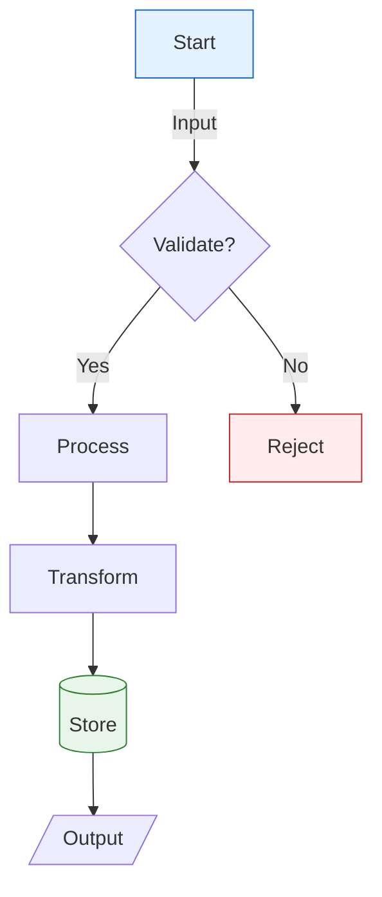
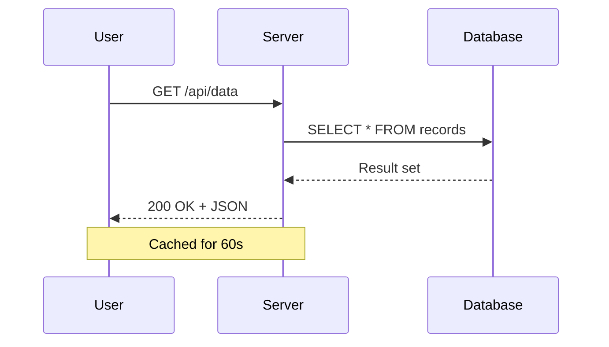
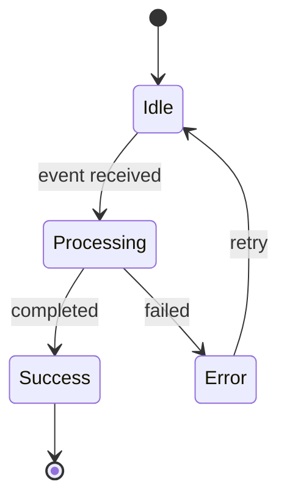
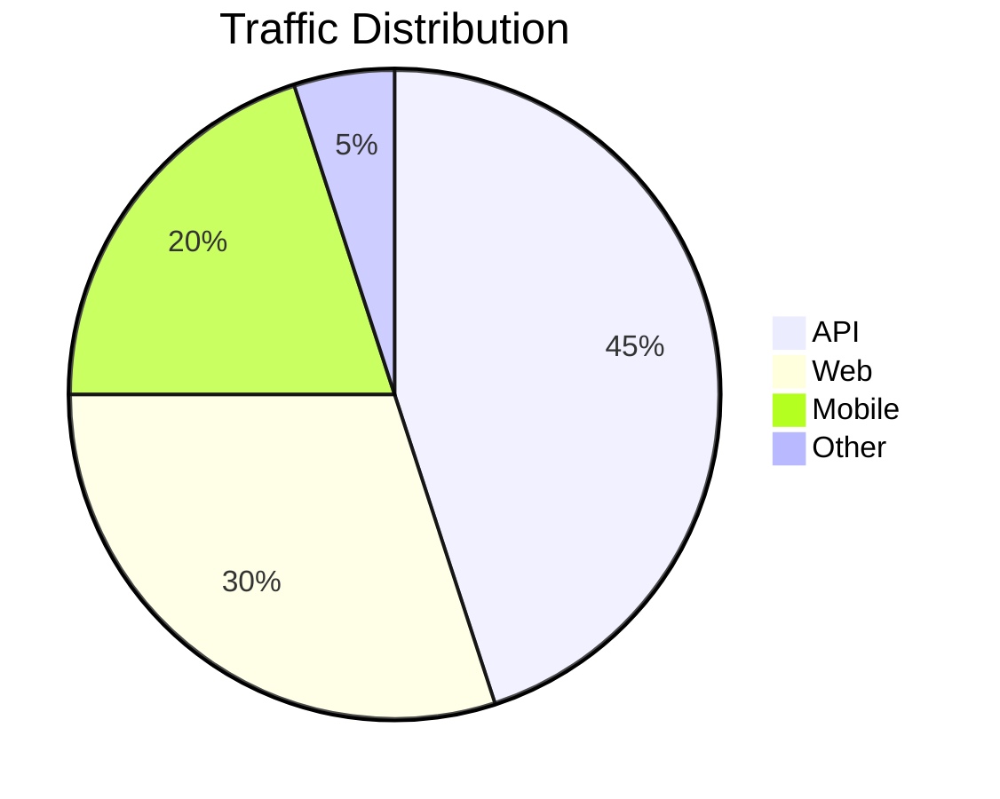

# md-to-pdf 功能测试文档

本文档练习了 `md-to-pdf` skill 支持的每一个渲染功能。
成功转换将生成一份包含所有元素正确渲染的多页 PDF。

---

## 1. Mermaid 图表

### 1.1 流程图



### 1.2 时序图



### 1.3 状态图



### 1.4 饼图



## 2. LaTeX 数学公式

### 2.1 行内公式

一元二次方程求根公式为 $x = \frac{-b \pm \sqrt{b^2 - 4ac}}{2a}$，其中 $ax^2 + bx + c = 0$。

爱因斯坦著名公式：$E = mc^2$。欧拉恒等式：$e^{i\pi} + 1 = 0$。

### 2.2 展示公式

高斯积分：

$$\int_{-\infty}^{\infty} e^{-x^2} \, dx = \sqrt{\pi}$$

麦克斯韦方程组的微分形式：

$$\nabla \cdot \mathbf{E} = \frac{\rho}{\epsilon_0}$$

$$\nabla \times \mathbf{B} = \mu_0 \mathbf{J} + \mu_0 \epsilon_0 \frac{\partial \mathbf{E}}{\partial t}$$

矩阵方程：

$$\begin{pmatrix} a & b \\ c & d \end{pmatrix} \begin{pmatrix} x \\ y \end{pmatrix} = \begin{pmatrix} ax + by \\ cx + dy \end{pmatrix}$$

傅里叶变换：

$$\hat{f}(\xi) = \int_{-\infty}^{\infty} f(x) \, e^{-2\pi i x \xi} \, dx$$

## 3. 表格

### 3.1 标准表格

| 功能 | 状态 | 备注 |
| ------- | ------------ | ------------------ |
| Mermaid | 支持 | 所有图表类型 |
| LaTeX | 支持 | 行内和展示 |
| 表格 | 支持 | GFM 管道表格 |
| 代码 | 支持 | 语法高亮 |

### 3.2 数值表格

| 指标 |  Q1 |  Q2 |  Q3 |  Q4 | 年度 |
| ------------ | ---: | ---: | ---: | ---: | -----: |
| 收入 ($M) | 12.4 | 15.1 | 18.7 | 22.3 | 68.5 |
| 用户 (K) | 340 | 412 | 520 | 681 | 681 |
| 延迟 (ms) | 45 | 38 | 32 | 28 | 36 |

## 4. 代码块

### 4.1 Python

```python
from typing import TypeVar, Generic
from dataclasses import dataclass

T = TypeVar("T")

@dataclass
class Result(Generic[T]):
    """Rust-inspired Result type."""
    value: T | None = None
    error: str | None = None

    @property
    def is_ok(self) -> bool:
        return self.error is None

    def unwrap(self) -> T:
        if self.error:
            raise ValueError(self.error)
        return self.value  # type: ignore
```

### 4.2 Go

```go
package main

import (
    "fmt"
    "sync"
)

func fanOut(input <-chan int, workers int) []<-chan int {
    channels := make([]<-chan int, workers)
    for i := 0; i < workers; i++ {
        ch := make(chan int)
        channels[i] = ch
        go func(out chan<- int) {
            defer close(out)
            for v := range input {
                out <- v * v
            }
        }(ch)
    }
    return channels
}
```

### 4.3 SQL

```sql
WITH ranked AS (
    SELECT
        user_id,
        event_type,
        created_at,
        ROW_NUMBER() OVER (PARTITION BY user_id ORDER BY created_at DESC) AS rn
    FROM events
    WHERE created_at > CURRENT_DATE - INTERVAL '7 days'
)
SELECT user_id, event_type, created_at
FROM ranked
WHERE rn = 1;
```

## 5. 文本格式

**加粗文本**，*斜体文本*，***粗斜体***，~~删除线~~，以及 `行内代码`。

### 5.1 块引用

> "抽象的目的不是为了模糊，而是为了创建一个新的语义层次，在其中可以做到绝对精确。"
>
> — Edsger W. Dijkstra

### 5.2 嵌套列表

1. 第一级有序
   - 第二级无序
   - 另一个项目
     1. 第三级有序
     2. 另一个有序项
2. 回到第一级
   - 混合嵌套有效

### 5.3 定义列表

术语一
: 第一个术语的定义，附带一些解释。

术语二
: 第二个术语的定义。可以包含 `代码` 和 **格式**。

### 5.4 脚注

这个声明需要引用[^1]。另一个引用在这里[^2]。

[^1]: 第一个脚注，附带支持证据。

[^2]: 第二个脚注，提供额外上下文。

## 6. 水平线

上方内容。

---

下方内容。

## 7. 链接和图片

访问 [example.com](https://example.com) 获取更多信息。

## 8. 结论

如果上述所有部分在输出的 PDF 中都能正确渲染——图表为矢量 SVG，数学公式为正确排版的方程，表格带有交替行颜色，代码带有语法高亮——则该 skill 功能正常。

行内公式验证：圆的面积为 $A = \pi r^2$，周长为 $C = 2\pi r$。
