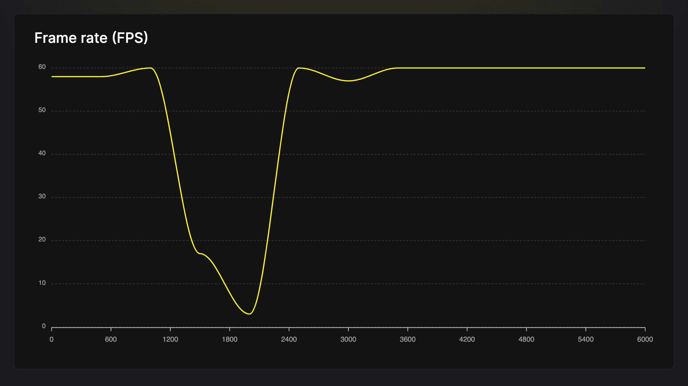

# 技能：高阶列表

用 FlatList 或 FlashList 替换 ScrollView，实现高性能的大列表渲染。

## 快速模式

**错误做法：**

```jsx
<ScrollView>
  {items.map((item) => <Item key={item.id} {...item} />)}
</ScrollView>
```

**正确做法：**

```jsx
<FlashList
  data={items}
  keyExtractor={(item) => item.id}
  renderItem={({ item }) => <Item {...item} />}
  estimatedItemSize={50}
/>
```

## 适用场景

- 渲染超过 10-20 个列表项
- 列表滚动卡顿或延迟
- 加载列表数据时应用卡死
- 长列表导致内存使用激增

## 前置条件

- 安装了 `@shopify/flash-list`（推荐）
- 了解列表虚拟化

## 分步说明

### 1. 识别问题



FPS 图显示了列表渲染期间的严重性能问题：
- FPS 从 ~60 开始（流畅）
- 在繁重列表操作期间降至 ~3 FPS
- 渲染完成后恢复

```jsx
// 错误：ScrollView 一次性渲染所有项目
const BadList = ({ items }) => (
  <ScrollView>
    {items.map((item, index) => (
      <View key={index}>
        <Text>{item}</Text>
      </View>
    ))}
  </ScrollView>
);
```

有 5000 个项目时，这立即创建了 5000 个视图，导致：
- 多秒卡死
- FPS 降至 0
- 高内存使用

### 2. 替换为 FlatList

```jsx
import { FlatList } from 'react-native';

const BetterList = ({ items }) => {
  const renderItem = ({ item }) => (
    <View>
      <Text>{item}</Text>
    </View>
  );
  
  return (
    <FlatList
      data={items}
      renderItem={renderItem}
      keyExtractor={(item, index) => index.toString()}
    />
  );
};
```

FlatList 仅渲染可见项 + 缓冲区（窗口化）。

### 3. 使用 getItemLayout 优化 FlatList

对于固定高度项，跳过布局测量：

```jsx
const ITEM_HEIGHT = 50;

const OptimizedList = ({ items }) => {
  const renderItem = ({ item }) => (
    <View style={{ height: ITEM_HEIGHT }}>
      <Text>{item}</Text>
    </View>
  );
  
  const getItemLayout = (_, index) => ({
    length: ITEM_HEIGHT,
    offset: ITEM_HEIGHT * index,
    index,
  });
  
  return (
    <FlatList
      data={items}
      renderItem={renderItem}
      keyExtractor={(item, index) => index.toString()}
      getItemLayout={getItemLayout}
    />
  );
};
```

### 4. 升级到 FlashList（最佳性能）

```bash
npm install @shopify/flash-list
```

```jsx
import { FlashList } from '@shopify/flash-list';

const BestList = ({ items }) => {
  const renderItem = ({ item }) => (
    <View style={{ height: 50 }}>
      <Text>{item}</Text>
    </View>
  );
  
  return (
    <FlashList
      data={items}
      renderItem={renderItem}
      estimatedItemSize={50}  // FlashList 需要
    />
  );
};
```

**FlashList 优势：**
- 回收视图而非创建新视图
- 基准测试中性能评分 78/100 vs 25/100
- 更流畅的滚动 ~54 FPS vs FlatList 较低

## 代码示例

### 可变高度项

```jsx
// 为 estimatedItemSize 计算平均值
// 项高度 50px、100px、150px
// 平均值：(50 + 100 + 150) / 3 = 100px

<FlashList
  data={items}
  renderItem={renderItem}
  estimatedItemSize={100}
/>
```

### 混合项类型

```jsx
<FlashList
  data={items}
  renderItem={({ item }) => {
    if (item.type === 'header') return <Header {...item} />;
    if (item.type === 'product') return <Product {...item} />;
    return <DefaultItem {...item} />;
  }}
  getItemType={(item) => item.type}  // 有助于回收
  estimatedItemSize={80}
/>
```

### FlatList 优化（如果不使用 FlashList）

```jsx
<FlatList
  data={items}
  renderItem={renderItem}
  // 性能属性
  removeClippedSubviews={true}
  maxToRenderPerBatch={10}
  updateCellsBatchingPeriod={50}
  initialNumToRender={10}
  windowSize={5}
  // 避免重新渲染
  keyExtractor={(item) => item.id}
  extraData={selectedId}  // 仅在选择变化时
/>
```

## 性能对比

| 组件 | 加载 5000 项 | 滚动 FPS | 内存 |
|-----------|-----------------|------------|--------|
| ScrollView | 卡死 1-3 秒 | < 30 | 高 |
| FlatList | ~100ms | ~45 | 中 |
| FlashList | ~50ms | ~54 | 低 |

## 决策矩阵

| 场景 | 推荐 |
|----------|---------------|
| < 20 个静态项 | ScrollView 可以 |
| 20-100 项 | 至少 FlatList |
| > 100 项 | FlashList |
| 复杂项布局 | FlashList 带 `getItemType` |
| 固定高度项 | 添加 `getItemLayout` 或 `estimatedItemSize` |

## 常见陷阱

- **内联 renderItem 函数**：导致重新渲染。在外部定义或使用 `useCallback`。
- **缺少 keyExtractor**：尽可能使用唯一 ID，而非数组索引。
- **忽略 estimatedItemSize 警告**：FlashList 如果未设置会发出警告。始终提供。
- **重型项组件**：保持列表项轻量。将副作用移出。

## 相关技能

- [js-profile-react.md](./js-profile-react.md) —— 分析列表渲染
- [js-measure-fps.md](./js-measure-fps.md) —— 测量滚动性能
