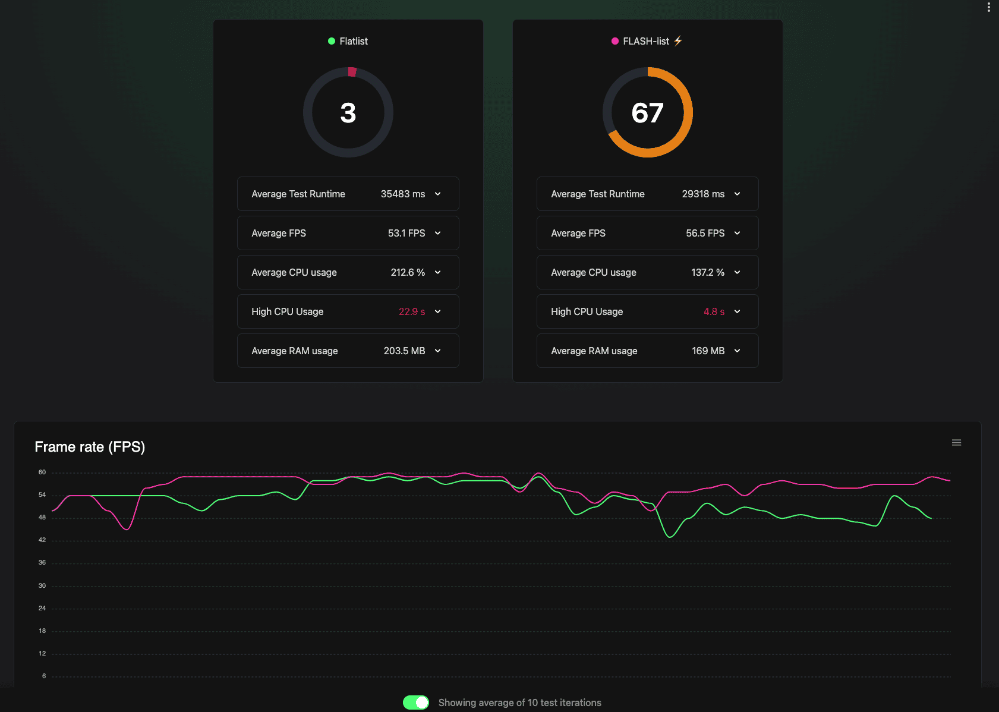

# 技能：测量 JS FPS

监控和测量 JavaScript 帧率以量化应用流畅度并识别性能回归。

## 快速命令

```bash
# 方法 1：内置性能监控
# 摇动设备 → 开发者菜单 → "性能监控"

# 方法 2：Flashlight（Android，详细报告）
# 首先从官方、经过验证的发布渠道安装 Flashlight。
flashlight measure
```

## 适用场景

- 动画感觉卡顿或掉帧
- 滚动不流畅
- 需要优化前后的 FPS 基线指标
- 希望跨构建比较性能

## 前置条件

- 在设备/模拟器上运行 React Native 应用
- Flashlight 需要 Android 设备（不支持 iOS）

> **注意**：本技能涉及解读视觉输出（FPS 图、性能覆盖层）。AI 代理尚无法自主处理截图。请将此作为手动审查指标时的指南，或等待基于 MCP 的视觉反馈集成（见路线图）。

## 分步说明

### 方法 1：React 性能监控（快速检查）

1. 打开开发者菜单：
   - iOS 模拟器：`Ctrl + Cmd + Z` 或 设备 > 摇动
   - Android 模拟器：`Cmd + M`（Mac）/ `Ctrl + M`（Windows）

2. 选择 **"性能监控"**

3. 观察覆盖层显示：
   - **UI（主）线程 FPS** —— 原生渲染
   - **JS 线程 FPS** —— JavaScript 执行
   - **RAM 使用量**

4. 从开发者菜单选择"隐藏性能监控"来隐藏

**解读：**
- **60 FPS** = 流畅（每帧 16.6ms）
- **< 60 FPS** = 掉帧
- **120 FPS** 目标用于高刷新率设备（每帧 8.3ms）

### 方法 2：Flashlight（自动化基准测试）

> 仅限 Android。提供详细报告和 JSON 导出。



Flashlight 显示对比性能数据：
- **评分**（0-100）：总体性能评级（越高越好）
- **平均 FPS**：流畅滚动的目标为 60 FPS
- **FPS 图**：测试期间的实时帧率
- **CPU/RAM 指标**：资源消耗

图中显示 FlatList（评分：3）vs FlashList（评分：67）—— 评分和 FPS 图都呈现出显著差异。

**安装：**

在安装前，从供应商的官方发布渠道获取 Flashlight。优先使用包管理器或带校验和/签名验证的版本固定二进制文件。不要将远程安装脚本直接通过管道传给 shell。

**使用：**

```bash
# 开始测量（应用必须在 Android 上运行）
flashlight measure
```

**功能：**
- 实时 FPS 图
- 平均 FPS 计算
- CPU 和 RAM 指标
- 总体性能评分
- JSON 导出用于 CI 对比

### 重要：禁用开发者模式

**始终禁用开发模式以获得准确测量：**

**Android：**
1. 打开开发者菜单
2. 设置 > JS Dev Mode → **关闭**

**iOS（React Native CLI）：**
```bash
# 以生产模式运行 Metro
npx react-native start --reset-cache
# 然后构建 release 变体
```

**Expo：**
```bash
# 无开发模式启动 Metro
npx expo start --no-dev --minify
# 为获得准确测量，使用 EAS Build 进行 release 测试
```

## 代码示例

### 识别 FPS 下降来源

如果 **UI FPS 下降但 JS FPS 正常：**
- 原生渲染问题
- 过多视图/复杂布局
- 繁重的原生动画

如果 **JS FPS 下降但 UI FPS 正常：**
- JavaScript 计算阻塞
- 昂贵的 React 重新渲染
- 查找 `longRunningFunction` 模式

如果 **两者都下降：**
- 混合问题，从 JS 性能分析开始

### 目标帧预算

```javascript
// 60 FPS = 每帧 16.6ms
const FRAME_BUDGET_60 = 16.6;

// 120 FPS = 每帧 8.3ms
const FRAME_BUDGET_120 = 8.3;

// 如果函数执行时间更长，将掉帧
const longRunningFunction = () => {
  let i = 0;
  while (i < 1000000000) { // 这会阻塞数秒！
    i++;
  }
};
```

## 结果解读

| FPS 范围 | 用户感知 | 行动 |
|-----------|-----------------|--------|
| 55-60 | 流畅 | 可接受 |
| 45-55 | 轻微卡顿 | 调查 |
| 30-45 | 明显卡顿 | 需要优化 |
| < 30 | 非常卡顿 | 需要关键修复 |

## Flashlight CI 集成

```bash
# 导出测量结果到 JSON
flashlight measure --output results.json

# 比较构建
flashlight compare baseline.json current.json
```

## 常见陷阱

- **在开发者模式下测量**：结果会人为变慢
- **不使用真实设备**：模拟器不反映真实性能
- **忽略 UI 线程**：React Native 有两个线程 —— JS 问题不一定在 UI 线程上显现
- **单次测量**：运行多次，FPS 会波动

## 相关技能

- [js-profile-react.md](./js-profile-react.md) —— 查找导致 FPS 下降的原因
- [js-animations-reanimated.md](./js-animations-reanimated.md) —— 修复动画相关掉帧
- [js-bottomsheet.md](./js-bottomsheet.md) —— 测量底部面板手势和吸附性能
- [js-lists-flatlist-flashlist.md](./js-lists-flatlist-flashlist.md) —— 修复滚动相关掉帧
