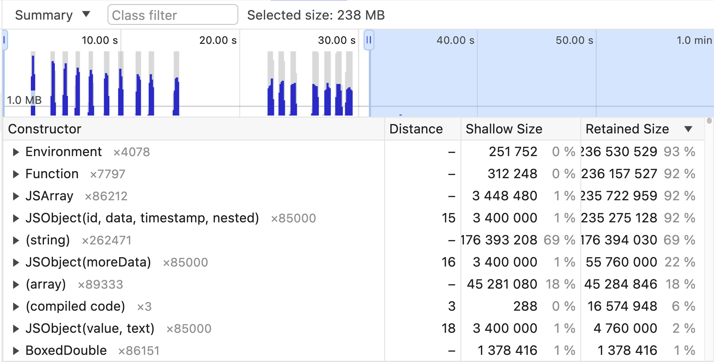

# 技能：查找 JS 内存泄漏

使用 React Native DevTools 内存性能分析发现和修复 JavaScript 内存泄漏。

## 快速模式

**错误做法（监听器未清理）：**

```jsx
useEffect(() => {
  const sub = EventEmitter.addListener('event', handler);
  // 缺少清理！
}, []);
```

**正确做法（正确清理）：**

```jsx
useEffect(() => {
  const sub = EventEmitter.addListener('event', handler);
  return () => sub.remove();
}, []);
```

## 适用场景

- 应用内存使用随时间增长
- 长时间使用后应用崩溃
- 屏幕间导航增加内存
- 怀疑事件监听器或定时器未清理

## 前置条件

- 可访问 React Native DevTools
- 应用在开发模式下运行

## 分步说明

### 1. 打开内存性能分析器

1. 启动 React Native DevTools（在 Metro 中按 `j`）
2. 转到 **Memory** 标签
3. 选择 **"Allocation instrumentation on timeline"**

### 2. 记录内存分配

1. 点击底部的 **"Start"**
2. 执行可能导致泄漏的操作（导航、触发事件等）
3. 等待 10-30 秒
4. 点击 **"Stop"**

### 3. 分析时间线

**关键指标：**
- **蓝色条** = 已分配内存
- **灰色条** = 已释放内存（垃圾回收）
- **保持蓝色的蓝色条** = 可能泄漏！

### 4. 调查泄漏对象



内存标签显示：
- **时间线**（顶部）：蓝色条 = 分配，选择时间范围以过滤
- **汇总视图**（底部）：列出带有分配计数的构造函数

**关键列：**
- **Constructor**：对象类型（例如 `JSObject`、`Function`、`(string)`）
- **Count**：实例数量（×85000 = 85,000 个对象）
- **Shallow Size**：对象本身的内存
- **Retained Size**：删除对象后释放的内存（包括引用）

**红旗**：Retained size 百分比大但 Shallow size 百分比小 = 闭包或引用持有大对象。

**调查方法：**
1. 点击时间线上的蓝色尖峰
2. 查看下方的构造函数列表
3. 检查 **Shallow size** vs **Retained size**
4. 展开构造函数查看单独分配
5. 点击查看确切的源代码位置

### 5. 验证修复

修复后，重新进行分析。所有条应为灰色（除了最近的一个）。

## 代码示例

### 常见泄漏模式

**1. 监听器未清理：**

```jsx
// 错误：内存泄漏
const BadEventComponent = () => {
  useEffect(() => {
    const subscription = EventEmitter.addListener('myEvent', handleEvent);
    // 缺少清理！
  }, []);
  
  return <Text>Listening...</Text>;
};

// 正确：正确清理
const GoodEventComponent = () => {
  useEffect(() => {
    const subscription = EventEmitter.addListener('myEvent', handleEvent);
    return () => subscription.remove(); // 清理！
  }, []);
  
  return <Text>Listening...</Text>;
};
```

**2. 定时器未清除：**

```jsx
// 错误：内存泄漏
const BadTimerComponent = () => {
  useEffect(() => {
    const timer = setInterval(() => {
      setCount(prev => prev + 1);
    }, 1000);
    // 缺少清理！
  }, []);
};

// 正确：正确清理
const GoodTimerComponent = () => {
  useEffect(() => {
    const timer = setInterval(() => {
      setCount(prev => prev + 1);
    }, 1000);
    return () => clearInterval(timer); // 清理！
  }, []);
};
```

**3. 闭包捕获大对象：**

```jsx
// 错误：闭包捕获整个数组
class BadClosureExample {
  private largeData = new Array(1000000).fill('data');
  
  createLeakyFunction() {
    return () => this.largeData.length; // 捕获 this.largeData
  }
}

// 正确：只捕获需要的内容
class GoodClosureExample {
  private largeData = new Array(1000000).fill('data');
  
  createEfficientFunction() {
    const length = this.largeData.length; // 提取值
    return () => length; // 只捕获原始值
  }
}
```

**4. 全局数组增长：**

```jsx
// 错误：全局数组从未清空
let leakyClosures = [];

const createLeak = () => {
  const data = generateLargeData();
  leakyClosures.push(() => data); // 持续增长！
};

// 正确：完成后清空或使用 WeakRef
const createNoLeak = () => {
  const data = generateLargeData();
  const closure = () => data;
  // 使用它，然后让其被垃圾回收
  return closure;
};
```

## 内存性能分析器指标

| 指标 | 含义 |
|--------|---------|
| **Shallow size** | 对象本身持有的内存 |
| **Retained size** | 删除对象后释放的内存（包括引用） |

**Retained size 大但 Shallow size 小** = 对象持有对其他大对象的引用（常见于闭包）。

## 常见陷阱

- **未主动触发 GC**：GC 定期运行。分配其他内容以触发垃圾回收，然后再得出存在泄漏的结论。
- **忽略灰色条**：灰色 = 正确回收。只有持续的蓝色条才是泄漏。
- **缺少 useEffect 清理**：最常见的 React Native 泄漏源。

## 相关技能

- [native-memory-leaks.md](./native-memory-leaks.md) —— 原生侧内存泄漏
- [js-profile-react.md](./js-profile-react.md) —— 通用性能分析
