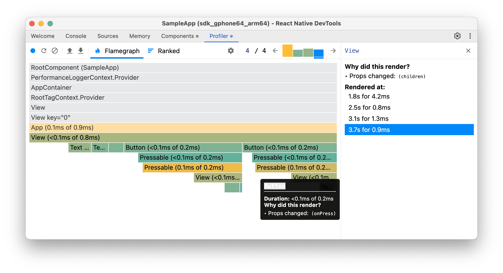

# 技能：分析 React 性能

使用 React Native DevTools 识别 React Native 应用中的不必要重新渲染和性能瓶颈。

## 快速命令

```bash
# 打开 React Native DevTools（在 Metro 终端中按 'j'）
# 或摇动设备 → "Open DevTools"
# 转至 Profiler 标签 → 开始分析 → 执行操作 → 停止
```

## 适用场景

- 应用在交互期间感觉迟钝或卡顿
- 需要识别哪些组件不必要地重新渲染
- 调查缓慢的列表滚动或表单输入
- 在应用 memoization 或状态管理变更之前

## 前置条件

- 可访问 React Native DevTools（在 Metro 中按 `j` 或使用开发者菜单）
- 应用在开发模式下运行
- React DevTools 6.0.1+ 版本（用于 React Compiler 支持）

> **注意**：本技能涉及解读可视化性能分析输出（火焰图、组件高亮）。AI 代理尚无法自主处理截图。请将此作为手动审查性能分析 UI 时的指南，或等待基于 MCP 的视觉反馈集成（见路线图）。

## 分步说明

### 1. 打开 React Native DevTools

```bash
# 选项 A：在 Metro 终端中按 'j'（RN CLI 和 Expo 均可）
# 选项 B：摇动设备 / Cmd+D（iOS）/ Cmd+M（Android）→ "Open DevTools"
# Expo：也可通过浏览器中的 Expo DevTools 访问
```

### 2. 配置分析器设置

1. 转到 **Profiler** 标签
2. 点击齿轮图标（⚙️）进行设置
3. 启用：
   - "Highlight updates when components render"
   - "Record why each component rendered while profiling"

### 3. 记录分析会话

```
1. 点击 "Start profiling"（蓝色圆圈）或 "Reload and start profiling"
2. 执行你要分析的操作
3. 点击 "Stop profiling"
```

对启动性能分析使用 **"Reload and start profiling"**。

### 4. 分析火焰图



火焰图显示组件渲染层级结构和时间：

**颜色指示：**
- **黄色组件**：渲染时间最长（重点关注）
- **绿色组件**：快速/已 memoize
- **灰色组件**：未渲染

**右侧面板显示"为什么渲染？"：**
- Props 变化（显示哪个 prop，例如 `children`、`onPress`）
- 在时间戳处渲染，带有持续时间（例如"3.7s 处 0.9ms"）

**点击组件可查看：**
- 渲染原因（hook 变化、props 变化、父组件重新渲染）
- 渲染持续时间
- 受影响的子组件

### 5. 使用排名视图进行自底向上分析

点击 "Ranked" 标签，查看按渲染时间排序的组件（最慢的优先）。

### 6. 分析 JavaScript CPU

对于非 React 的性能问题：

1. 转到 **JavaScript Profiler** 标签（如果在设置中隐藏，先启用）
2. 点击 "Start" 记录
3. 执行操作
4. 点击 "Stop"
5. 使用 **Heavy（Bottom Up）** 视图查找最慢的函数

## 代码示例

### 之前：不必要的重新渲染

```jsx
const App = () => {
  const [count, setCount] = useState(0);
  
  return (
    <View>
      <Text>{count}</Text>
      {/* 每次 count 变化时按钮都重新渲染 */}
      <Button onPress={() => setCount(count + 1)} title="Press" />
    </View>
  );
};

const Button = ({onPress, title}) => (
  <Pressable onPress={onPress}>
    <Text>{title}</Text>
  </Pressable>
);
```

### 之后：已 Memoize

```jsx
const App = () => {
  const [count, setCount] = useState(0);
  const onPressHandler = useCallback(() => setCount(c => c + 1), []);
  
  return (
    <View>
      <Text>{count}</Text>
      <Button onPress={onPressHandler} title="Press" />
    </View>
  );
};

const Button = memo(({onPress, title}) => (
  <Pressable onPress={onPress}>
    <Text>{title}</Text>
  </Pressable>
));
```

## 结果解读

| 症状 | 可能原因 | 解决方案 |
|---------|--------------|----------|
| 许多黄色组件 | 级联重新渲染 | 添加 memoization 或使用 React Compiler |
| 回调显示"Props changed" | 内联函数重建 | 使用 `useCallback` |
| "Parent component rendered" | 状态在树中位置过高 | 将状态下移或使用原子化状态 |
| 长时间 JS 线程阻塞 | 繁重计算 | 移至后台或使用 `useDeferredValue` |

## 常见陷阱

- **在开发模式下分析**：始终禁用 JS Dev Mode 以获得准确的测量结果（Android 的 Settings > JS Dev Mode）
- **未使用生产构建**：某些问题仅在压缩代码中出现
- **忽略"为什么渲染？"**：这准确告诉你要修复什么

## 相关技能

- [js-react-compiler.md](./js-react-compiler.md) —— 自动 memoization
- [js-atomic-state.md](./js-atomic-state.md) —— 用 Jotai/Zustand 减少重新渲染
- [js-bottomsheet.md](./js-bottomsheet.md) —— 分析底部面板回调驱动下的重新渲染
- [js-measure-fps.md](./js-measure-fps.md) —— 量化帧率影响
