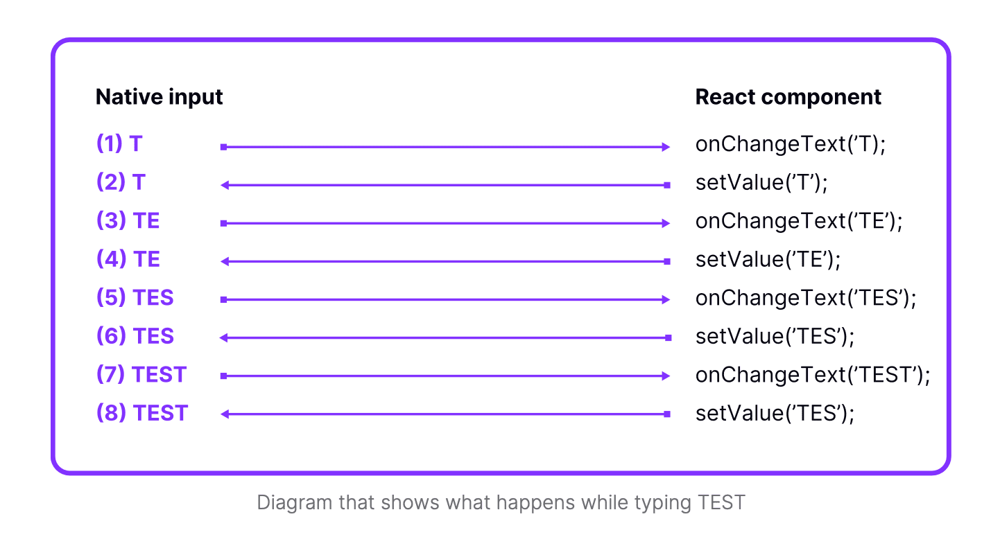

# 技能：非受控组件

使用非受控组件模式修复 TextInput 同步和闪烁问题。

## 快速模式

**之前（受控 —— 在旧架构上可能闪烁）：**

```jsx
<TextInput value={text} onChangeText={setText} />
```

**之后（非受控 —— 原生拥有状态）：**

```jsx
<TextInput defaultValue={text} onChangeText={setText} />
```

## 适用场景

- TextInput 在快速输入时闪烁或显示错误字符
- 在低端设备上文本输入滞后于用户输入
- 使用传统（非新架构）React Native
- 需要最大的输入响应性

## 前置条件

- 了解 React 受控与非受控组件
- 使用了 TextInput 组件

## 问题描述



该图显示了使用受控 `TextInput` 输入"TEST"时发生的情况：

1. 用户输入"T" → 触发 `onChangeText('T')`
2. React 调用 `setValue('T')` → 原生更新为"T"
3. 用户输入"E" → 触发 `onChangeText('TE')`
4. React 调用 `setValue('TE')` → 原生更新为"TE"
5. ...对每个字符继续

**问题**：每个字符都需要在原生和 JavaScript 之间往返。在旧架构上，如果 React 状态更新较慢，原生可能显示中间状态（闪烁）。

**新架构说明**：此问题在新架构中基本解决，但非受控模式仍提供最佳性能。

## 分步说明

### 1. 识别受控 TextInput

```jsx
// 受控 —— value prop 将状态同步到原生
const ControlledInput = () => {
  const [value, setValue] = useState('');
  
  return (
    <TextInput
      value={value}           // 这导致同步问题
      onChangeText={setValue}
    />
  );
};
```

### 2. 转换为非受控

移除 `value` prop 使其变为非受控：

```jsx
// 非受控 —— 原生拥有状态
const UncontrolledInput = () => {
  const [value, setValue] = useState('');
  
  return (
    <TextInput
      defaultValue={value}     // 仅设置初始值
      onChangeText={setValue}  // 仍更新 React 状态
    />
  );
};
```

### 3. 使用 Ref 进行程序化控制

如果需要以编程方式读取/设置值：

```jsx
const UncontrolledWithRef = () => {
  const inputRef = useRef(null);
  
  const clearInput = () => {
    inputRef.current?.clear();
  };
  
  const getValue = () => {
    // 使用 onChangeText 追踪值，或使用原生方法
  };
  
  return (
    <TextInput
      ref={inputRef}
      defaultValue=""
      onChangeText={(text) => console.log('Current:', text)}
    />
  );
};
```

## 代码示例

### 完整迁移示例

**之前（受控）：**

```jsx
const SearchInput = () => {
  const [query, setQuery] = useState('');
  const [results, setResults] = useState([]);
  
  const handleChange = (text) => {
    setQuery(text);
    fetchResults(text).then(setResults);
  };
  
  return (
    <View>
      <TextInput
        value={query}              // 移除这个
        onChangeText={handleChange}
        placeholder="搜索..."
      />
      <ResultsList data={results} />
    </View>
  );
};
```

**之后（非受控）：**

```jsx
const SearchInput = () => {
  const [query, setQuery] = useState('');
  const [results, setResults] = useState([]);
  
  const handleChange = (text) => {
    setQuery(text);
    fetchResults(text).then(setResults);
  };
  
  return (
    <View>
      <TextInput
        defaultValue=""           // 仅初始值
        onChangeText={handleChange}
        placeholder="搜索..."
      />
      <ResultsList data={results} />
    </View>
  );
};
```

### 何时需要值控制

对于修改输入的输入掩码或验证：

```jsx
// 选项 1：接受受控行为（可能闪烁）
const MaskedInput = () => {
  const [value, setValue] = useState('');
  
  const handleChange = (text) => {
    // 电话号码掩码：(123) 456-7890
    const masked = maskPhone(text);
    setValue(masked);
  };
  
  return (
    <TextInput
      value={value}  // 掩码必需
      onChangeText={handleChange}
    />
  );
};

// 选项 2：使用原生掩码输入库
// react-native-masked-text 原生处理
```

## 决策矩阵

| 场景 | 推荐 |
|----------|---------------|
| 简单文本输入 | 非受控 |
| 搜索/筛选输入 | 非受控 |
| 提交时验证的表单 | 非受控 |
| 输入掩码（电话、信用卡） | 受控或原生库 |
| 逐字符验证 | 受控 |
| 新架构应用 | 两种均可 |

## 常见陷阱

- **忘记 `defaultValue`**：没有它，输入从空白开始
- **尝试用状态清空**：改用 `ref.current.clear()`
- **混合模式**：不要同时使用 `value` 和 `defaultValue`

## 相关技能

- [js-profile-react.md](./js-profile-react.md) —— 分析输入性能
- [js-concurrent-react.md](./js-concurrent-react.md) —— 延迟昂贵的搜索操作
