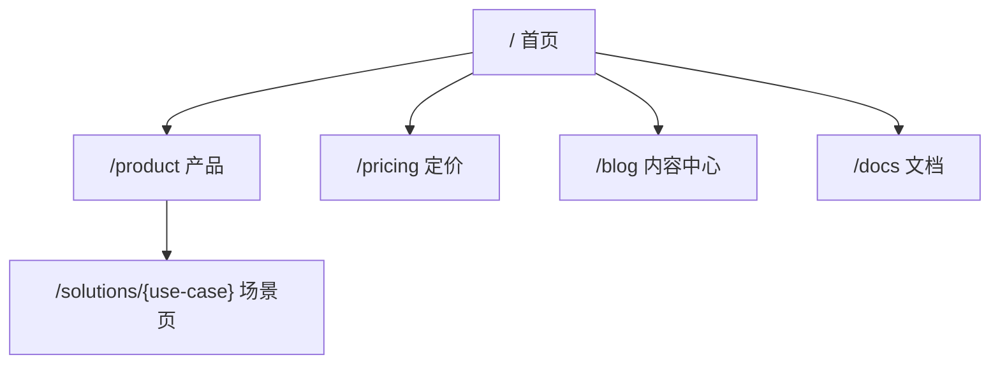
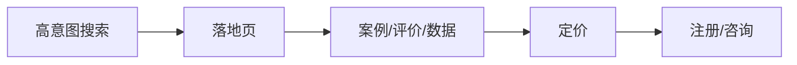
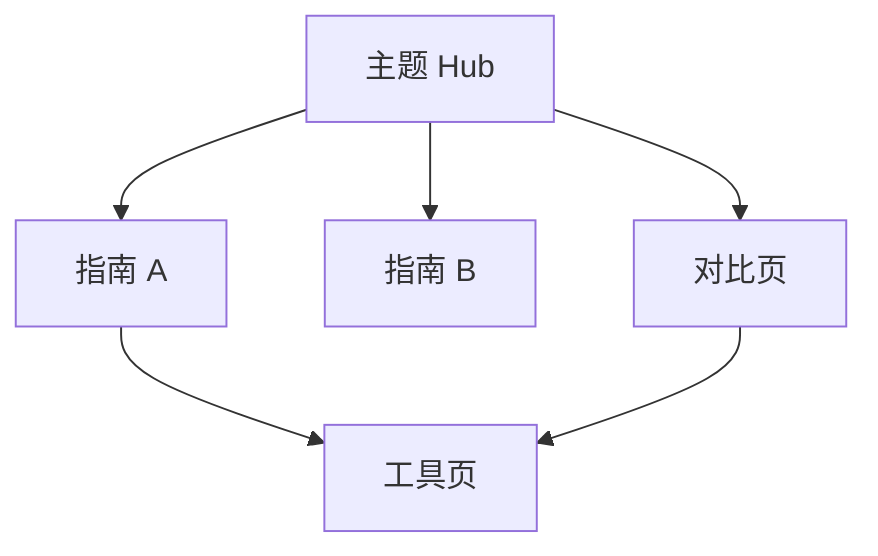
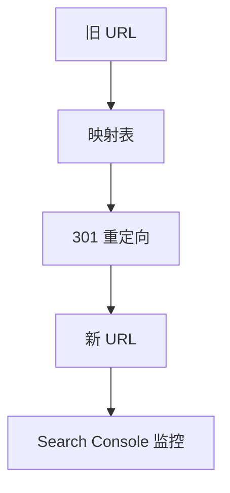

# SEO 架构 Mermaid 模板

## 站点层级图

```mermaid
flowchart TD
    home["/ 首页"]
    product["/product 产品"]
    pricing["/pricing 定价"]
    blog["/blog 内容中心"]
    docs["/docs 文档"]
    usecase["/solutions/{use-case} 场景页"]

    home --> product
    home --> pricing
    home --> blog
    home --> docs
    product --> usecase
```

## 转化路径图

```mermaid
flowchart LR
    query["高意图搜索"] --> landing["落地页"]
    landing --> proof["案例/评价/数据"]
    proof --> pricing["定价"]
    pricing --> signup["注册/咨询"]
```

## 内链集群图

```mermaid
flowchart TD
    hub["主题 Hub"]
    guide1["指南 A"]
    guide2["指南 B"]
    compare["对比页"]
    tool["工具页"]

    hub --> guide1
    hub --> guide2
    hub --> compare
    guide1 --> tool
    compare --> tool
```

## 迁移计划图

```mermaid
flowchart TD
    old["旧 URL"]
    map["映射表"]
    redirect["301 重定向"]
    new["新 URL"]
    monitor["Search Console 监控"]

    old --> map --> redirect --> new --> monitor
```

## 使用约束

- 节点标签写 URL + 页面职责，不只写页面名。
- 图只表达一个问题：层级、路径、内链或迁移，不混在一起。
- 对重定向和 noindex 这类风险动作，要在图后补文字清单。
