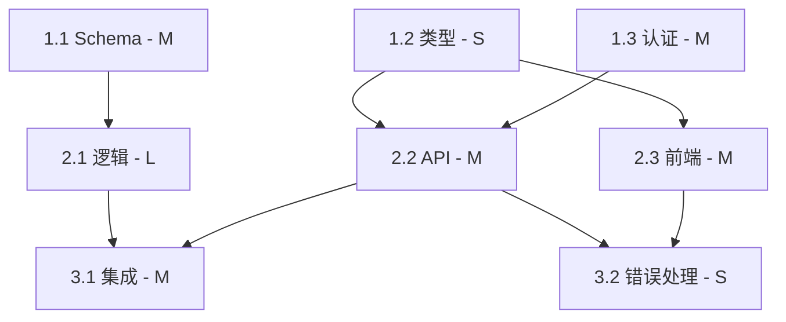

# 依赖映射

构建任务序列的依赖图、识别关键路径以及最大化并行度。

---

## 依赖类型

| 类型 | 符号 | 含义                              | 示例                             |
| ---- | ---- | --------------------------------- | -------------------------------- |
| 硬   | →    | B 在 A 完成之前无法开始           | 数据库表 → 查询                  |
| 软   | ⇢    | B 受益于 A 但可以使用 stub        | API 端点 ⇢ 前端集成              |
| 无   | ∥    | 独立，可以并行运行                | 端点 A ∥ 端点 B                  |

### 识别硬依赖

任务存在硬依赖的情况：

- 需要另一个任务的输出产物（表、接口、模块）
- 修改相同的文件（同一时间只能一人编辑文件）
- 需要特定的系统状态（认证必须在授权之前完成）

### 识别软依赖

任务存在软依赖的情况：

- 可以使用 mock 或 stub 替代真实实现
- 可以使用简化版本并在后续升级
- 集成点有定义的契约（接口、API 规范）

---

## 关键路径

关键路径是最长的依赖任务链。它决定了整个功能的最短工期。

### 计算

1. 列出从开始到结束的所有依赖链
2. 汇总每条链的工作量估算值
3. 最长的链就是关键路径

```text
示例：
链 1：任务 1.1 (M) → 任务 2.1 (L) → 任务 3.1 (M) = M+L+M
链 2：任务 1.2 (S) → 任务 2.2 (M) → 任务 3.1 (M) = S+M+M
链 3：任务 1.1 (M) → 任务 2.3 (S) → 任务 3.1 (M) = M+S+M

关键路径：链 1（最长）
```

### 优化关键路径

1. **拆分关键路径上的最大任务** — 能否并行化？
2. **将工作移出关键路径** — 能否重新排序任务？
3. **Stub 依赖** — 通过尽早定义接口将硬依赖转为软依赖
4. **最先启动关键路径** — 不要延迟关键路径任务

---

## 并行化

### 最大并行度

统计在任何时间点可以同时执行的最大任务数。

```text
阶段 1：[1.1] [1.2] [1.3]        → 3 个并行
阶段 2：[2.1→1.1] [2.2→1.2]      → 2 个并行
阶段 3：[3.1→2.1,2.2]            → 1（汇聚点）
```

### 并行化机会

| 机会                | 描述                                      |
| ------------------- | ----------------------------------------- |
| 独立功能            | 没有共享状态的两个功能                    |
| 前端 + 后端         | 同一功能，双方都按已定义契约工作          |
| 数据 + 逻辑         | Schema 设计 ∥ 算法原型                    |
| 测试 + 实现         | 测试结构 ∥ 实现 (TDD)                    |
| 文档 + 代码         | 如果 API 契约已定义                       |

---

## 可视化

### 简单文本格式

```text
1.1 数据库 schema [M] ────────────────┐
1.2 API 类型/接口 [S] ─────┐          │
1.3 认证中间件 [M] ─────┐   │          │
                        │   │          │
2.1 业务逻辑 [L] ───────┼───┼──────────┤（依赖于 1.1）
2.2 API 端点 [M] ───────┼───┘          │（依赖于 1.2）
2.3 前端组件 [M] ───────┘              │（依赖于 1.2）
                                       │
3.1 集成测试 [M] ──────────────────────┘（依赖于 2.1, 2.2）
3.2 错误处理 [S] ───────────────────────（依赖于 2.2, 2.3）
```

### Mermaid 图



---

## 依赖反模式

| 反模式                           | 问题                                              | 修复                                                     |
| -------------------------------- | ------------------------------------------------- | -------------------------------------------------------- |
| 一切依赖一切                     | 无并行，单线程执行                                | 发现并打破不必要的依赖                                   |
| 隐藏依赖                         | 任务失败因为未声明的先决条件未完成                | 使所有依赖显式化                                         |
| 循环依赖                         | A→B→C→A，无从开始                                | 使用接口打破循环                                         |
| 过度序列化                       | 可以并行的任务被标记为依赖                        | 质疑每个依赖："B 能用 stub 开始吗？"                     |
